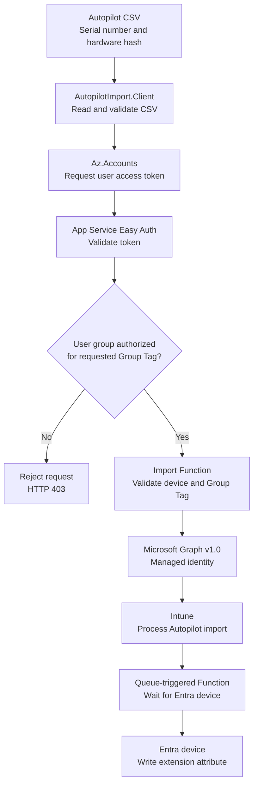

<!-- markdownlint-disable-next-line MD033 -->
<h1 align="center">Intune AutoPilot Importer</h1>

This Azure Function imports Windows Autopilot hardware hashes from a CSV file. The user authenticates to the Function API with their Entra account. Microsoft Graph is called exclusively through the system-assigned managed identity of the Function.

The client requests a Device Tag. The Function accepts it only when the server-side policy permits that tag for at least one Entra security group in the caller's token. After Intune creates the Entra device, the Function also writes the authorized tag to a configured Entra device extension attribute. The default is `extensionAttribute1`. Optionally, the Function adds the device to a configured Entra administrative unit (MAU) or restricted management administrative unit (RMAU).

## The Problem

Granting a user permission to import Windows Autopilot hardware hashes does not, by itself, restrict which Group Tag the user can assign. The standard import authorization does not require a tag, validate that a supplied tag is approved, or verify that the importing user is authorized to use that specific tag. A user who is allowed to import a hardware hash could therefore omit the Group Tag or assign a tag intended for a different device population, potentially placing the
device into an unintended dynamic group and its associated deployment profile, applications, and policies.

This project closes that authorization gap by validating the requested Group Tag server-side and allowing the import only when the authenticated user belongs to an Entra security group mapped to that tag.

## The solution

The client script reads the serial number and hardware hash from an Autopilot CSV supplied as a parameter.

- `Az.Accounts` requests a user token for the Function API.
- Azure App Service Authentication, also known as Easy Auth, validates the token.
- The Function requires a matching group-to-tag rule for the authenticated caller.
- The managed identity submits only the authorized tag to Microsoft Graph v1.0.
- Intune processes the import asynchronously.
- A queue-triggered Function waits for the Entra device and writes the tag to the configured `extensionAttribute1` through `extensionAttribute15`.



## Howto use the AutopilotImporter

### Web frontend

After installation, open the `webUrl` reported by the installer or stored in
`client.settings.json`. The page itself contains no tenant data and may load
without authentication. Import functions become available only after the user
signs in with a Microsoft Entra account.

The frontend provides the following functions:

- German and English user interface with a persistent language selection
- Microsoft Entra sign-in using Authorization Code Flow with PKCE
- Local validation of Autopilot CSV files before any data is transmitted
- Selection of only those Group Tags authorized for the signed-in user's Entra
    groups
- Parallel submission of up to three devices to the secured Function API
- Display of serial number, import ID, processing status, and error details
- Automatic monitoring of both the Intune import and the Entra device
    extension-attribute update
- Sign-out from the current Entra session

The hardware hashes are not stored by the frontend. They remain in browser
memory and are sent only to the secured Function API after validation and user
confirmation.

#### Import a Device During Windows OOBE

During Windows Out-of-Box Experience, press **Shift + F10** to open Command
Prompt, then start Windows PowerShell:

```cmd
powershell.exe
```

Install the standalone importer from PowerShell Gallery:

```powershell
Install-Script -Name Import-AutopilotDevice
```

On a computer where no script installation directory has been configured yet,
PowerShellGet may ask to add its Scripts directory to `PATH`. Confirm the prompt
to run the installed script by name. PowerShellGet may also ask whether the
PSGallery repository should be used; confirm only after verifying that the
repository name is `PSGallery`.

Run the importer with the complete HTTPS application URL and an authorized
Group Tag:

```powershell
Import-AutopilotDevice.ps1 `
    -ApplicationUrl 'https://<function-app-name>.azurewebsites.net' `
    -GroupTag 'Autopilot-Standard'
```

For a deployment with a custom domain, use that HTTPS origin instead:

```powershell
Import-AutopilotDevice.ps1 `
    -ApplicationUrl 'https://autopilot.contoso.com' `
    -GroupTag 'Autopilot-Standard'
```

`ApplicationUrl` must be an absolute URL including `https://`. The Function App
root, `/api/ui`, and the complete `/api/ui/index.html` URL are accepted. When
`-CsvPath` is omitted, the script reads the local BIOS serial number and
Autopilot hardware hash, signs the user in through Azure PowerShell, submits the
device, and monitors processing until the workflow completes or fails. Add
`-Verbose` to display diagnostic details.

The script requires an elevated Windows PowerShell 5.1 or PowerShell 7 session.
It installs `Az.Accounts` for the current user when the module is not already
available and has no dependency on `Get-WindowsAutopilotInfo`. Do not change the
execution policy to `Unrestricted`; use the execution policy approved by your
organization.

#### Import Workflow and Status Updates

1. Sign in with an Entra account that belongs to an authorized importer group.
2. Select or drop an Autopilot CSV containing `Device Serial Number` and
     `Hardware Hash`.
3. Select one of the Group Tags returned for the signed-in account.
4. Start the import and keep the page open while processing continues.

The frontend performs the first status request immediately after submission.
While at least one device is pending, it refreshes the status every 15 seconds.
Polling stops when every device has reached `complete` or `error`. Temporary
status-request errors are displayed and retried during the next polling cycle.

Import IDs and status rows are kept only in the current page's memory. Closing
or reloading the page ends monitoring and clears the displayed results. The
import itself continues in Azure and can be checked later with
`Get-AutoPilotImportStatus -ImportId '<import-id>'`.

The PowerShell module remains available and uses the same authorization policy.

The installer deploys `AutopilotImport.Client`. On first use, initialize the
module with the Function URL. The module stores the public, non-secret runtime
configuration in the current user's profile and reuses it for later commands.

### Import a device hash

Use the `Import-AutoPilotDevice` command to submit one or more device hashes from a CSV file to Intune. Before you begin, make sure that:

- `AutopilotImport.Client` has been installed and initialized once with the
    Function URL.
- Your account belongs to an Entra security group that is authorized for the
    Group Tag you want to use.
- The CSV contains the columns `Device Serial Number` and `Hardware Hash`.

The selected Group Tag is applied to every device in the CSV. First, validate the file locally without signing in or sending data to the Azure Function:

```powershell
Import-AutoPilotDevice `
    -CsvPath '.\devices.csv' `
    -GroupTag 'PAW' `
    -ValidateOnly
```

If validation succeeds, run the same command without `-ValidateOnly`:

```powershell
Import-AutoPilotDevice `
    -CsvPath '.\devices.csv' `
    -GroupTag 'PAW'
```

PowerShell signs you in with your Entra account when an access token is needed. The Azure Function then verifies that your account is authorized for the requested Group Tag before submitting each device to Intune. No Azure role, Microsoft Graph permission, client secret, or direct Intune role is required on the importing computer.

The client package also contains the standalone REST client
`Import-AutopilotDevice.ps1`. It reads the public runtime configuration from
the application URL and does not require `AutopilotImport.Client`. Supply a CSV
to import one or more devices, or omit `-CsvPath` to collect the serial number
and hardware hash from the local Windows device in an elevated session:

```powershell
powershell.exe -NoProfile -File .\Import-AutopilotDevice.ps1 `
    -ApplicationUrl 'https://autopilot.contoso.com' `
    -GroupTag 'PAW'
```

The script validates the data and submits the hash through the REST API without
a confirmation prompt. It displays the import and device-attribute status every
10 seconds until the complete workflow succeeds or fails. Use `-Verbose` for
additional configuration, authentication, request, and polling details. Use
`-ValidateOnly` to validate configuration and device data without
authentication, or `-WhatIf` to preview the import without requesting a token
or submitting data.

Initialize the module once for the current Windows user:

```powershell
Get-AutoPilotImporterClientConfiguration `
    -FunctionUrl 'https://<function-app>.azurewebsites.net'
```

The command retrieves `/api/ui/config` over HTTPS and stores the resulting
non-secret settings in
`$HOME\.autopilotimporter\client.settings.json`. Subsequent commands load that
file automatically. Use `-ConfigPath` to select another configuration file.
Explicit `-FunctionUrl`, `-ApiApplicationIdUri`, and `-TenantId` values on the
operational commands override file settings, allowing one computer to target
multiple environments.

### Display Client Configuration

Display the persisted configuration currently used by the client module:

```powershell
Get-AutoPilotImporterClientConfiguration
```

Select a different configuration file and display every property:

```powershell
Get-AutoPilotImporterClientConfiguration `
    -ConfigPath 'C:\AutopilotImport\client.settings.json' |
    Format-List
```

### Track Import Status

A successful request returns HTTP 202 and an `importId`. Intune processes the request asynchronously. Check the current state:

```powershell
Get-AutoPilotImportStatus -ImportId '<import-id>'
```

Wait for a final end-to-end result:

```powershell
Get-AutoPilotImportStatus `
    -ImportId '<import-id>' `
    -Wait
```

The default timeout is 30 minutes with a 15-second polling interval. Override these values with `-TimeoutSeconds` and `-PollIntervalSeconds`. Only `workflowStatus: complete` confirms that both the Intune import and the Entra extension-attribute update succeeded.

## Autopilot-importer management

### Check Installed and Deployed Versions

Compare the active PowerShell module with the Function code currently serving
the management API:

```powershell
$moduleVersion = (Get-Module AutopilotImport.Client).Version
$functionVersion = (Get-AutoPilotTagPolicy -Raw).functionVersion

[pscustomobject]@{
    PowerShellModule = $moduleVersion
    AzureFunction    = $functionVersion
}
```

Import `AutopilotImport.Client` first if `Get-Module` returns no result. The
Function version is also returned in the `X-AutopilotImport-Version` response
header. Updating the Function deployment and updating client modules are
separate operations, so their versions can temporarily differ.

### Read Import History

Every authenticated importer can read the imports they requested during the
last 30 days. The command is exported by the `AutopilotImport.Client` module.
It is not a standalone script in the extracted deployment package. Install the
generated client module package as described under
[Distribute the Import Client to Additional PCs](#5-distribute-the-import-client-to-additional-pcs),
then open a new PowerShell 7 session.

Verify which installed module version provides the command:

```powershell
Get-Command Get-AutoPilotImportHistory -All |
    Select-Object Name, Version, Source
```

If an older module is already loaded in the current session, load the newest
installed version:

```powershell
$module = Get-Module -ListAvailable AutopilotImport.Client |
    Sort-Object Version -Descending |
    Select-Object -First 1

if (-not $module) {
    throw 'AutopilotImport.Client is not installed. Extract the generated client module package into a directory listed in $env:PSModulePath.'
}

Remove-Module AutopilotImport.Client -ErrorAction SilentlyContinue
Import-Module $module.Path -Force
```

Then retrieve the import history:

```powershell
Get-AutoPilotImportHistory
```

Retrieve one or more specific records by their displayed import ID, Autopilot
serial number, or the Base64 DeviceHash used for the import. These targeted
lookups also show who requested the import, even when it was requested by
another user:

```powershell
Get-AutoPilotImportHistory -ImportId @(
    '11111111-1111-1111-1111-111111111111'
    '22222222-2222-2222-2222-222222222222'
)

Get-AutoPilotImportHistory `
    -SerialNumber '7892-5288-2670-2860-4823-9507-73'

$deviceHash = (Import-Csv '.\AutopilotHWID.csv')[0].'Hardware Hash'
Get-AutoPilotImportHistory -DeviceHash $deviceHash
```

Configured importer managers and, when enabled, Intune Role Administrators can
request every retained record:

```powershell
Get-AutoPilotImportHistory -ShowAll
```

The command displays a compact table with import GUID (`ImportId`), serial
number, Group Tag, status, requesting user, request time, completion time, and
Intune error name. Every row remains a PowerShell object that can be filtered,
exported, or inspected with all available properties:

```powershell
Get-AutoPilotImportHistory | Format-List *
```

The command returns up to 100 operations by default. Request up to 1000 and
filter the objects in the pipeline, for example to inspect failed imports:

```powershell
Get-AutoPilotImportHistory -Top 1000 |
    Where-Object Status -eq 'error'
```

Each result contains the import ID, batch import ID, serial number, Group Tag,
status, Intune error details, and the requesting user's display name, user
principal name, and Entra object ID. UTC timestamps record when the request was
received, the Graph import was created, processing was queued and started, the
Entra device was resolved, its extension attribute was updated, optional
administrative-unit membership was confirmed, and processing completed.
Audit metadata is stored for 30 days in the deployment's private Azure Table
Storage. The raw DeviceHash and its SHA-256 search index are stored with the
audit record; product keys are not stored. Neither value is returned in history
results, and the client sends only the SHA-256 index when `-DeviceHash` is used.
A timer removes expired records hourly. Imports created before this audit
feature was deployed cannot be found by DeviceHash because no hash was recorded
for them.

If the command reports that the history endpoint was not found, update the
Function App with `Update-AutopilotImport.ps1` without `-SkipPublish`. A 404
response means the deployed Function package does not contain the
`GetImportHistory` endpoint; it does not mean that the history is empty.

### Change Group-to-Tag Assignments

The installing user, configured manager users or groups, and current members of the Intune RBAC role `Intune Role Administrator` may update the policy. They do not need Azure resource permissions.

Read the current policy:

```powershell
Get-AutoPilotTagPolicy
```

#### Add a Group Tag Policy

`Add-AutoPilotTagPolicy` adds an Entra group to the policy without replacing
the other group rules. If the group already has a rule, the command adds the
specified tags to that rule. Existing and duplicate tags are retained only
once.

Parameters:

- `-GroupId` accepts the Entra group object ID. `-Group` remains available as
    an alias for compatibility.
- `-GroupTag` accepts one or more Autopilot Group Tags. `-Tag` is an alias.
- `-Mau` optionally sets a regular or restricted management administrative
    unit for the added or updated rule. The full parameter name is
    `-AdministrativeUnitName`. If omitted, an existing unit for that rule is
    preserved; a new rule has no administrative unit. Supply an empty string
    to remove the assignment.
- `-WhatIf` previews the update without writing it to the Azure Function.

Add a group by its object ID and set the MAU:

```powershell
Add-AutoPilotTagPolicy `
    -GroupId '11111111-1111-1111-1111-111111111111' `
    -GroupTag 'Autopilot-Privileged' `
    -Mau 'MAU-Autopilot-Devices' `
    -WhatIf
```

Run the command without `-WhatIf` to apply the change.

Add another tag to an existing group rule without changing its other tags:

```powershell
Add-AutoPilotTagPolicy `
    -GroupId '11111111-1111-1111-1111-111111111111' `
    -GroupTag 'Autopilot-Shared'
```

#### Remove a Group Tag Policy

`Remove-AutoPilotTagPolicy` removes selected tags from one Entra group when
`-GroupTag` is supplied. Without `-GroupTag`, it removes the complete Group Tag
rule for that group. Other group rules and their individual RMAUs remain
unchanged. The command does not delete the group from Entra.

Parameters:

- `-Group` accepts either the Entra group object ID or its exact display name.
    `-GroupId` and `-GroupName` are aliases for this parameter.
- `-GroupTag` optionally selects one or more tags to remove. `-Tag` is an alias.
    Omit it to remove the complete group rule.
- `-WhatIf` previews the removal without writing it to the Azure Function.

Remove one tag while preserving the group's other tags:

```powershell
Remove-AutoPilotTagPolicy `
    -Group '11111111-1111-1111-1111-111111111111' `
    -GroupTag 'Autopilot-Kiosk'
```

Remove a rule using its exact Entra group display name:

```powershell
Remove-AutoPilotTagPolicy `
    -Group 'Obsolete Autopilot Group' `
    -WhatIf
```

Alternatively, remove it by group object ID:

```powershell
Remove-AutoPilotTagPolicy `
    -Group '11111111-1111-1111-1111-111111111111'
```

If multiple Entra groups have the same display name, use the object ID. The
last tag cannot be removed from a group rule. Omit `-GroupTag` to remove that
complete rule instead. The last policy rule cannot be removed because the
Function requires at least one group-to-tag rule. Run the command without
`-WhatIf` to apply the removal.

After a successful complete-rule removal, the command prints a concise message
such as `The tag policy for group 'Obsolete Autopilot Group' was removed.`
Removing selected tags produces the corresponding tag-specific message. The
returned string also exposes `GroupId`, `GroupName`, `RemovedTags`,
`RuleRemoved`, `CorrelationId`, `Updated`, and `ApiResponse` properties for
automation.

#### Replace the Complete Group Tag Policy

Each rule can specify its own regular or restricted management administrative
unit through `administrativeUnitName`.
Preview the complete desired policy before applying it:

```powershell
Set-AutoPilotTagPolicy `
    -TagAuthorizationRule @(
        [pscustomobject]@{
            groupId = '11111111-1111-1111-1111-111111111111'
            tags = @('Autopilot-Standard', 'Autopilot-Kiosk')
            administrativeUnitName = 'RMAU-Standard'
        }
        [pscustomobject]@{
            groupId = '33333333-3333-3333-3333-333333333333'
            tags = @('Autopilot-Privileged')
            administrativeUnitName = 'RMAU-Privileged'
        }
    ) `
    -WhatIf
```

Run the same command without `-WhatIf` to apply it. Omit a previous rule to
remove that group. Omit `administrativeUnitName` from a
rule to disable automatic administrative-unit membership for that rule.
`-AdministrativeUnitName` or `-Mau` applies a shared fallback to string rules.

Every configured administrative unit must already exist and have a unique
display name. This is validated through Microsoft Graph before a new or
updated policy is saved. Both units with and without
`isMemberManagementRestricted` enabled are supported. Without a configured
unit on the matching rule, imports continue without automatic membership.

### Change Group Tag Managers

List the installing manager and all additionally configured managers:

```powershell
Get-AutoPilotTagPolicyManager
```

The command returns structured objects containing `FunctionAppName`,
`PrincipalId`, and `ManagerType` (`Installer` or `Additional`). It reads the
manager policy through Azure and does not modify it.

`Add-AutoPilotTagPolicyManager`, `Remove-AutoPilotTagPolicyManager`, and
`Update-AutoPilotTagPolicyManager` can be run only by a principal with an
effective Azure `Owner` or `Contributor` assignment on the Function App, its
resource group, or its subscription. Being an explicitly configured Group Tag
manager or an Intune Role Administrator does not grant permission to change the
manager list.

```powershell
Update-AutoPilotTagPolicyManager `
    -AddPrincipalId '44444444-4444-4444-4444-444444444444' `
    -RemovePrincipalId '33333333-3333-3333-3333-333333333333' `
    -WhatIf
```

The convenience commands enforce the same Azure role check:

```powershell
Add-AutoPilotTagPolicyManager `
    -PrincipalId '44444444-4444-4444-4444-444444444444'

Remove-AutoPilotTagPolicyManager `
    -PrincipalId '33333333-3333-3333-3333-333333333333'
```

The installing user cannot be removed. Authorization for current Intune Role Administrators remains enabled.

## Installation

### Prerequisites

- An Azure subscription and an active Intune tenant
- For the simplest end-to-end installation, the installing administrator needs the Azure `Owner` role at subscription scope and the Entra ID `Global Administrator` role. For a least-privilege installation, see [Required Roles and Permissions](#required-roles-and-permissions).
- PowerShell 7.2 or later on the importing computer
- An Autopilot CSV containing `Device Serial Number` and `Hardware Hash`
- For deployment: `Az.Accounts`, `Az.Resources`, `Az.Storage`, `Az.Websites`, and the Bicep CLI; `-InstallMissingModules` installs missing components. See [Appendix: Bicep CLI in Restricted Environments](#appendix-bicep-cli-in-restricted-environments) when automatic downloads are blocked.
- For the one-time permission assignment: `Microsoft.Graph.Authentication`

### Quick Installation Guide

1. Obtain the Azure, Entra ID, and delegated Microsoft Graph permissions listed under [Required Roles and Permissions](#required-roles-and-permissions). The installing administrator needs all applicable permissions for the complete setup.
2. Download `Intune-autopilotImporter-<branch><version>.zip` and extract it. Open PowerShell 7 in the extracted package directory containing `Install-AutopilotImport.ps1`.
3. Start the interactive installation. Missing PowerShell modules and the Bicep CLI are installed when required:

```powershell
pwsh .\Install-AutopilotImport.ps1 -InstallMissingModules
```

1. After installation, extract the generated client module package from the current user's Documents directory into the PowerShell 7 module directory:

```powershell
$documents = [Environment]::GetFolderPath('MyDocuments')
$moduleRoot = Join-Path $documents 'PowerShell\Modules'

New-Item -Path $moduleRoot -ItemType Directory -Force | Out-Null
Expand-Archive `
    -LiteralPath (Join-Path $documents `
        'Intune-Autopilotimport-psmodule-<version>.zip') `
    -DestinationPath $moduleRoot `
    -Force
```

The archive already contains the required versioned module layout and the generated `client.settings.json`.

## Advanced Setup

### Required Roles and Permissions

Azure RBAC roles, Entra directory roles, Microsoft Graph permissions, and the application role of this Function serve different purposes. They do not grant one another implicitly.
For a standard installation, one installing administrator performs the complete setup and therefore needs the applicable Azure roles, Entra directory role, and delegated Microsoft Graph permissions listed below. The scopes remain technically independent even though they are assigned to the same administrator.

| Identity | Scope | Required role or permission | Purpose |
| --- | --- | --- | --- |
| Installing administrator | Azure subscription | `Contributor` plus `Role Based Access Control Administrator` or `User Access Administrator`; alternatively `Owner` | Creates the resource group and resources, then assigns the scoped Storage data roles required for keyless access. |
| Installing administrator | Existing Azure resource group | `Contributor` plus `Role Based Access Control Administrator` or `User Access Administrator`; alternatively `Owner` | Sufficient when the resource group already exists. Equivalent subscription-level roles are then not required. |
| Installing administrator | Deployed Storage Account | `Storage Blob Data Contributor` | Uploads the initial Group Tag authorization policy using the signed-in Entra identity. Assigned automatically by the installer. |
| Installing administrator | Entra ID | Application owner, `Application Administrator`, or `Cloud Application Administrator` | Required when the app registration or enterprise application must be created or changed. An already compliant application is reused without a write. |
| Installing administrator | Microsoft Graph, delegated | `Application.ReadWrite.All`, `User.Read` | Configures the API application and records the installing user as a permanent Group Tag manager. |
| Installing administrator | Entra ID | `Privileged Role Administrator` or `Global Administrator` | Assigns the Microsoft Graph application permission to the Function App managed identity. |
| Installing administrator | Microsoft Graph, delegated | `Application.Read.All`, `AppRoleAssignment.ReadWrite.All` | Resolves the Microsoft Graph service principal and creates the app-role assignment for the managed identity. Admin consent is required. |
| Function App managed identity | Microsoft Graph, application | `DeviceManagementServiceConfig.ReadWrite.All` | Imports Windows Autopilot device identities. |
| Function App managed identity | Microsoft Graph, application | `DeviceManagementRBAC.Read.All` | Checks current membership of the Intune RBAC role `Intune Role Administrator` for Group Tag management requests. |
| Function App managed identity | Microsoft Graph, application | `GroupMember.Read.All`, `User.ReadBasic.All` | Checks the importing user's current membership in the Entra groups configured by the Group Tag policy. |
| Function App managed identity | Microsoft Graph, application | `Device.ReadWrite.All` | Writes the authorized Group Tag to the configured Entra device extension attribute after the device is created. |
| Function App managed identity | Microsoft Graph, application | `AdministrativeUnit.ReadWrite.All` | Resolves the optional MAU and adds the imported Entra device as a member. |
| Function App managed identity | Deployed Storage Account | `Storage Blob Data Owner` | Provides keyless host storage access and reads or updates the Group Tag authorization policy. Assigned automatically by the installer. |
| Function App managed identity | Deployed Storage Account | `Storage Queue Data Contributor` | Queues and retries the Entra device extension attribute update while Autopilot processing is incomplete. Assigned automatically by the installer. |
| Importing user or group | Function API | Matching group-to-tag rule | Allows importing devices with only the tags assigned to the caller's Entra security group. |
| Group Tag manager | Function API | Installer, configured manager user/group, or `Intune Role Administrator` | Reads and replaces the group-to-tag policy without Azure resource permissions. |
| Manager-list administrator | Azure Function App | `Owner` or `Contributor` at Function or ancestor scope | Adds or removes explicitly configured manager users and groups. The management script rejects other roles. |

The standard installer creates three role assignments scoped to the deployed Storage Account. The installing user receives `Storage Blob Data Contributor`, and the Function managed identity receives `Storage Blob Data Owner` and
`Storage Queue Data Contributor`. The installer therefore needs both resource deployment permissions and
`Microsoft.Authorization/roleAssignments/write`. If organizational policy uses custom Azure roles, they must also allow Function ZIP publishing for the resource types defined in `src/Infrastructure/main.bicep`.

The Consumption-plan deployment requires the Storage Account data endpoint to permit public network access. Blob public access and shared-key authentication remain disabled; both the installer and Function authenticate with Entra ID.
If Azure Policy requires `PublicNetworkAccess=Disabled`, this architecture requires a VNet-integrated hosting plan, Storage Private Endpoints, and private DNS instead of the standard Consumption template.

Importing users require no Azure subscription role, Entra directory role, Microsoft Graph permission, or direct Intune administrative role. Authorization is provided by the configured group-to-tag rule. The Function's managed
identity holds the Intune-related Graph permissions independently of the user.

Do not grant other principals Azure roles that can modify the Function App's application settings or deployed code. Such permissions can change the manager policy outside the provided script and therefore bypass its strict
`Owner`/`Contributor` check.

### Installation with `Install-AutopilotImport.ps1`

`Install-AutopilotImport.ps1` supports both an interactive installation and a
parameterized deployment. Run it from the root of the extracted installation
package in PowerShell 7.2 or later. Values that are not supplied as parameters
are requested interactively. The installer configures the Entra applications,
deploys the Azure resources, grants the managed identity its Microsoft Graph
permissions, publishes the Function code, verifies authentication, and creates
the client tools package.

For an interactive installation, including installation of missing local
prerequisites, run:

```powershell
pwsh .\Install-AutopilotImport.ps1 -InstallMissingModules
```

For a repeatable parameterized deployment, supply the deployment values
directly:

```powershell
pwsh .\Install-AutopilotImport.ps1 `
    -SubscriptionId '00000000-0000-0000-0000-000000000000' `
    -TenantId '11111111-1111-1111-1111-111111111111' `
    -ResourceGroupName 'rg-autopilot-import' `
    -Location 'westus2' `
    -FunctionAppName 'func-autopilot-contoso' `
    -TagAuthorizationRule `
        '22222222-2222-2222-2222-222222222222=Standard,Kiosk' `
    -InstallMissingModules `
    -Confirm:$false
```

Use `Get-Help .\Install-AutopilotImport.ps1 -Full` for all parameters and
examples. The following sections describe each installation stage and its
manual or separated-administration alternatives.

#### 1. Entra Application for the Function API

By default, the installer searches the selected tenant for an app registration named `Autopilot Import API`. If it does not exist, the installer creates and configures it automatically. During application setup, Microsoft Graph requests `Application.ReadWrite.All` and `User.Read`. The separate managed-identity permission step requests `Application.Read.All` and `AppRoleAssignment.ReadWrite.All`.

The installer compares the existing application with the desired configuration before writing. A user with read access can therefore reuse an already compliant application. Application ownership or an application administrator directory
role is required only when the application actually needs to be created or updated.

These delegated permissions apply only during installation. Function users do not receive them. The managed identity receives `DeviceManagementServiceConfig.ReadWrite.All`, `Device.ReadWrite.All`, `AdministrativeUnit.ReadWrite.All`, and the read-only `DeviceManagementRBAC.Read.All`, `GroupMember.Read.All`, and `User.ReadBasic.All` permissions.

The installer configures:

- A single-tenant app registration
- Application ID URI `api://<Application-Client-ID>`
- Delegated scope `DeviceHash.Import`
- Pre-authorization for Microsoft Azure PowerShell
- Security-group claims for endpoint-level authorization
- An enterprise application that allows authenticated tenant users to reach endpoint-level authorization
- A separate single-tenant SPA registration named `Autopilot Import Web`
- Authorization Code Flow with PKCE for the SPA, without a client secret
- SPA preauthorization for the `DeviceHash.Import` scope and the exact deployed frontend redirect URI

Use `-EntraClientId '<Client-ID>'` to select a specific existing application. Without this parameter, the installer searches by `-EntraApplicationName`, which defaults to `Autopilot Import API`.

##### Manual Alternative

Create a single-tenant app registration in the Entra admin center, for example `Autopilot Import API`.

Under **Expose an API**:

- Application ID URI: `api://<Application-Client-ID>`
- Delegated scope: `DeviceHash.Import`
- Consent: administrators only
- Authorized client application: `1950a258-227b-4e31-a9cf-717495945fc2` (Microsoft Azure PowerShell)
- Select the `DeviceHash.Import` scope for that client

Then configure the enterprise application:

1. Set **Assignment required?** to **No**.
2. Keep tenant access restricted through Easy Auth and the Function's endpoint-level policies.

The delegated scope allows Azure PowerShell to request a token for the API. It does not grant the user Microsoft Graph or Intune permissions.

#### 2. Deploy Azure Resources

The installer prompts for all values that were not supplied as parameters, validates the Bicep template, deploys the resources, assigns the Graph permission, publishes the Function code, and verifies that Easy Auth rejects anonymous requests with HTTP 401:

```powershell
pwsh .\Install-AutopilotImport.ps1 -InstallMissingModules
```

To sign out a cached Microsoft Graph account and sign in again as the installing administrator without changing the Azure PowerShell account, add `-ForceGraphSignIn`. The installer uses device-code authentication so the operator can open the sign-in page in the appropriate browser profile:

```powershell
pwsh .\Install-AutopilotImport.ps1 `
    -InstallMissingModules `
    -ForceGraphSignIn
```

Assigning Microsoft Graph application permissions requires a signed-in user with Application Administrator, Cloud Application Administrator, or Privileged Role Administrator in the target tenant. After a failed installation, retry
only the idempotent permission assignment with the managed identity object ID reported by the deployment:

```powershell
.\scripts\Grant-ManagedIdentityGraphPermission.ps1 `
    -ManagedIdentityObjectId '<Function-managed-identity-object-ID>' `
    -TenantId '<Tenant-ID>' `
    -ForceGraphSignIn
```

After the Azure resources are deployed, the installer creates a portable client tools package. It asks for the destination and suggests
`Documents\AutopilotImport`. The package contains:

- `Modules\AutopilotImport.Client\<version>\AutopilotImport.Client.psd1`
- `Modules\AutopilotImport.Client\<version>\AutopilotImport.Client.psm1`
- `Modules\AutopilotImport.Client\<version>\AutopilotImport.psm1`
- `Modules\AutopilotImport.Client\<version>\client.settings.json`
- `scripts\Import-AutopilotDevice.ps1`

The settings file contains the import and management URLs, API Application ID URI, Tenant ID, Subscription ID, resource group, and Function App name. It contains no credentials. The module loads these values automatically, while explicitly supplied parameters take precedence. The standalone import script instead reads its public configuration directly from the supplied application URL.

During installation and update, the installer creates `Intune-Autopilotimport-psmodule-<version>.zip` in the current user's Documents directory. An existing archive with the same version is replaced. The ZIP contains the current versioned PowerShell modules and `client.settings.json`, with the folder layout required by PowerShell module autoloading. Transfer the archive to another computer and extract it into the current user's PowerShell module directory:

```powershell
$moduleRoot = Join-Path `
    ([Environment]::GetFolderPath('MyDocuments')) `
    'PowerShell\Modules'
New-Item -Path $moduleRoot -ItemType Directory -Force | Out-Null
Expand-Archive `
    -LiteralPath (Join-Path `
        ([Environment]::GetFolderPath('MyDocuments')) `
        'Intune-Autopilotimport-psmodule-<version>.zip') `
    -DestinationPath $moduleRoot `
    -Force
```

After extraction, commands such as `Import-AutoPilotDevice` are available through PowerShell module autoloading. The user does not need to run `Import-Module` first. PowerShell 7.2 or later and the required Az modules must still be installed on the destination computer.

Each installation writes an activity transcript to the current user's temporary directory. The file name uses the pattern `Intune-Autopilotimport-install-<timestamp>-<unique-id>.log`. The console displays the full path when setup starts. If installation stops with an error, the transcript is closed before the log is extended with the complete PowerShell error record, exception properties, and script stack trace.

Import the newest installed module version from a custom tools directory:

```powershell
$module = Get-ChildItem `
    'C:\Tools\AutopilotImport\Modules\AutopilotImport.Client\*\AutopilotImport.Client.psd1' |
    Sort-Object { [version] $_.Directory.Name } -Descending |
    Select-Object -First 1
Import-Module $module.FullName
```

The module exports `New-AutoPilotImporterClientConfiguration`,
`Get-AutoPilotImporterClientConfiguration`, `Import-AutoPilotDevice`,
`Get-AutoPilotImportStatus`,
`Get-AutoPilotImportHistory`,
`Get-AutoPilotTagPolicy`,
`Add-AutoPilotTagPolicy`, `Remove-AutoPilotTagPolicy`,
`Set-AutoPilotTagPolicy`, `Get-AutoPilotTagPolicyManager`,
`Update-AutoPilotTagPolicyManager`,
`Add-AutoPilotTagPolicyManager`, and `Remove-AutoPilotTagPolicyManager`.

For normal import and policy API use, initialize the module from the deployed
Function URL. This does not require Azure subscription access:

```powershell
Get-AutoPilotImporterClientConfiguration `
    -FunctionUrl 'https://<function-app>.azurewebsites.net'
```

The configuration remains in
`$HOME\.autopilotimporter\client.settings.json` across module updates.

Manager-policy commands automatically search accessible subscriptions in the
configured tenant when Azure deployment values are missing. They match the
configured Function hostname, including a custom DNS name, against the Function
App hostname bindings and persist a unique match in the client profile.

When discovery cannot find a unique Function App, administrators can add the
Azure control-plane values explicitly. `FunctionAppName` is the Azure resource
name, not a custom DNS name:

```powershell
Get-AutoPilotImporterClientConfiguration `
    -FunctionUrl 'https://autopilot.example.com' `
    -SubscriptionId '<Subscription-ID>' `
    -ResourceGroupName 'rg-autopilot-import' `
    -FunctionAppName '<Function-App-Name>'
```

Running the URL bootstrap again preserves discovered or explicitly configured
Azure deployment details unless explicit replacement values are supplied.

To create a separate administrative configuration file instead, use
`New-AutoPilotImporterClientConfiguration`. By default, it creates
`client.settings.json` in the current directory. Use
`-OutputPath 'C:\Configuration'` to select another directory and `-Force` to
replace an existing file. Supply that file with `-ConfigPath` when running a
manager-policy command.

```text
Documents\PowerShell\Modules\AutopilotImport.Client\<version>\client.settings.json
```

The installer prompts for:

- Azure Subscription ID
- Entra Tenant ID
- Azure Resource Group
- Azure region
- Globally unique Function App name, with a generated name proposed by default
- Destination directory for the operational PowerShell scripts
- Entra device extension attribute for the authorized Group Tag; the default is `extensionAttribute1`
- Optional display name of an Entra administrative unit (MAU or RMAU)
- Entra group object IDs
- Allowed Device Tags for each group

Function App names must contain 2-60 letters, digits, or hyphens and must start and end with a letter or digit. The installer rejects an invalid `-FunctionAppName`; in interactive mode it asks again until the name is valid.

The Client ID is taken automatically from the existing or newly created app registration.

Group-to-tag rules are requested repeatedly in interactive mode. One group can receive multiple tags, and the same tag can be assigned to multiple groups.

For a non-interactive installation, pass all values as parameters:

```powershell
pwsh .\Install-AutopilotImport.ps1 `
    -SubscriptionId '<Subscription-ID>' `
    -TenantId '<Tenant-ID>' `
    -ResourceGroupName 'rg-autopilot-import' `
    -ResourceGroupTags @{ Environment = 'Production'; Owner = 'Endpoint Team' } `
    -Location 'westeurope' `
    -FunctionAppName '<globally-unique-name>' `
    -DeviceTagExtensionAttribute 'extensionAttribute1' `
    -TagAuthorizationRule `
        '11111111-1111-1111-1111-111111111111=Autopilot-Standard,Autopilot-Kiosk', `
        '22222222-2222-2222-2222-222222222222=Autopilot-Privileged' `
    -AdministrativeUnitName 'MAU-Autopilot-Devices' `
    -TagManagerPrincipalId `
        '33333333-3333-3333-3333-333333333333' `
    -ClientToolsPath 'C:\Tools\AutopilotImport' `
    -InstallMissingModules `
    -Confirm:$false
```

`-ResourceGroupTags` accepts an optional PowerShell hashtable. Tags are included in the request that creates a new resource group, allowing tag-enforcement policies to succeed. For an existing resource group, the installer merges the requested tags while leaving tags with other names unchanged.

Use `-WhatIf` for a safe preview that displays the configuration and planned action without creating Azure or Entra resources:

```powershell
pwsh .\Install-AutopilotImport.ps1 `
    -SubscriptionId '<Subscription-ID>' `
    -TenantId '<Tenant-ID>' `
    -ResourceGroupName 'rg-autopilot-import' `
    -Location 'westeurope' `
    -FunctionAppName '<globally-unique-name>' `
    -TagAuthorizationRule `
        '11111111-1111-1111-1111-111111111111=Autopilot-Standard' `
    -WhatIf
```

##### Azure DevOps Pipeline

The repository contains `azure-pipelines.yml`. Pull requests run the Pester tests. A successful run on `main` additionally deploys the Bicep template and Function ZIP through an Azure Resource Manager service connection. The generated `client.settings.json` is published as the pipeline artifact `autopilot-import-client-settings`.

Create an Azure DevOps service connection that uses workload identity federation. Grant its service principal `Contributor` on the target resource group. If the pipeline must create the resource group, grant `Contributor` at subscription scope instead. The pipeline service principal does not require Microsoft Graph permissions.

Create a variable group named `autopilot-import-deployment` with these values:

| Variable | Example | Purpose |
| --- | --- | --- |
| `azureServiceConnection` | `sc-autopilot-import` | Name of the Azure Resource Manager service connection |
| `subscriptionId` | `00000000-0000-0000-0000-000000000000` | Target Azure subscription |
| `tenantId` | `11111111-1111-1111-1111-111111111111` | Entra tenant |
| `resourceGroupName` | `rg-autopilot-import` | Target resource group |
| `location` | `westeurope` | Azure region |
| `functionAppName` | `func-autopilot-contoso` | Globally unique Function App name |
| `entraClientId` | `22222222-2222-2222-2222-222222222222` | Client ID of the preconfigured API app registration |
| `webClientId` | `55555555-5555-5555-5555-555555555555` | Client ID of the preconfigured SPA app registration |
| `installerPrincipalId` | `33333333-3333-3333-3333-333333333333` | Object ID of the user or group that remains a permanent Group Tag manager |
| `tagAuthorizationRulesJson` | `["44444444-4444-4444-4444-444444444444=Standard,Kiosk"]` | JSON array containing the complete group-to-tag policy |
| `tagManagerPrincipalIdsJson` | `[]` | JSON array of additional manager user or group object IDs |

Authorize the pipeline to use this variable group. None of these values is a credential; authentication is provided by workload identity federation.

The Entra API application and the managed identity's Microsoft Graph permissions remain intentionally outside the pipeline because they require privileged tenant permissions that should not be assigned to a deployment service connection.

Before the first pipeline deployment, create or configure the Entra API and SPA applications once from an administrator workstation. Supply their returned client IDs through `entraClientId` and `webClientId`:

```powershell
Install-Module Microsoft.Graph.Authentication -Scope CurrentUser
$entraApplication = .\src\Scripts\Ensure-EntraApiApplication.ps1 `
    -TenantId '<Tenant-ID>' `
    -DisplayName 'Autopilot Import API' `
    -Confirm:$false
$webApplication = .\src\Scripts\Ensure-EntraWebApplication.ps1 `
    -TenantId '<Tenant-ID>' `
    -ApiApplicationObjectId $entraApplication.ApplicationObjectId `
    -ApiClientId $entraApplication.ClientId `
    -ApiScopeId $entraApplication.ScopeId `
    -RedirectUri 'https://<function-app-name>.azurewebsites.net/api/ui/index.html' `
    -Confirm:$false
$entraApplication, $webApplication
```

After the first pipeline deployment has created the Function managed identity, a Privileged Role Administrator or Global Administrator runs the idempotent permission script once:

```powershell
Connect-AzAccount -Tenant '<Tenant-ID>' -Subscription '<Subscription-ID>'
$function = Get-AzWebApp `
    -ResourceGroupName 'rg-autopilot-import' `
    -Name '<function-app-name>'

.\src\Scripts\Grant-ManagedIdentityGraphPermission.ps1 `
    -ManagedIdentityObjectId $function.Identity.PrincipalId
```

Subsequent pipeline deployments update infrastructure, policies, and Function code without repeating either privileged Entra operation. Configure approvals and checks on the Azure DevOps environment `autopilot-import` when production deployments require manual authorization.

##### Update an Existing Deployment

Download or clone the desired release, then run the update script from its project directory. Preview the resolved deployment and planned installer action first:

```powershell
.\Update-AutopilotImport.ps1 -WhatIf
```

Apply the update:

```powershell
.\Update-AutopilotImport.ps1
```

To run the update without the execution confirmation, use `-Force`:

```powershell
.\Update-AutopilotImport.ps1 -Force
```

`-WhatIf` still takes precedence when combined with `-Force` and does not perform the update.

The deployment can also be selected using its Function URL. The script derives
the Function App name and searches the subscriptions accessible to the signed-in
Azure account to resolve the subscription, tenant, and resource group:

```powershell
.\Update-AutopilotImport.ps1 `
    -FunctionUrl 'https://func-autopilot-contoso.azurewebsites.net/api/ui/index.html'
```

The URL may include any Function API path, but must use the Function App's
`azurewebsites.net` hostname. When the same Function App name is visible in
multiple tenants or subscriptions, add `-SubscriptionId` to select the intended
deployment. Explicit `-TenantId`, `-ResourceGroupName`, or `-FunctionAppName`
values must match the resource found from the URL. Azure Reader access is
enough for discovery; the update itself still requires the permissions listed
below.

By default, the script selects the newest installed `client.settings.json` from the portable client package, `PSModulePath`, or the standard per-user and system-wide PowerShell module directories. Select another installed deployment explicitly when required:

```powershell
.\Update-AutopilotImport.ps1 `
    -ConfigPath 'C:\Tools\AutopilotImport\Modules\AutopilotImport.Client\<version>\client.settings.json'
```

After a successful update, the script also installs the current module and
configuration under
`C:\Program Files\WindowsPowerShell\Modules\AutopilotImport.Client\<version>`
and removes older versions when they are not in use. When the update is not
running with local administrator rights, it installs the current module in the
current user's PowerShell 7 and Windows PowerShell module directories instead.
The update continues and warns that the system-wide module remains unchanged
and must be updated later from an elevated PowerShell 7 session.

When the client module and configuration are not installed on the update computer, the script prompts for the subscription ID, tenant ID, resource group, Function App name, and client tools destination. The current Az context and standard deployment names are offered as defaults. These values can also be supplied for an unattended discovery phase:

```powershell
.\Update-AutopilotImport.ps1 `
    -SubscriptionId '00000000-0000-0000-0000-000000000000' `
    -TenantId '11111111-1111-1111-1111-111111111111' `
    -ResourceGroupName 'rg-autopilot-import' `
    -FunctionAppName 'func-autopilot-contoso' `
    -ClientToolsPath 'C:\Tools\AutopilotImport' `
    -InstallMissingModules
```

In this mode, and when using `-FunctionUrl`, the API audience is read from the deployed Function App and the management endpoint is derived from its hostname. Use `-ApiAudience` or `-ManagementUrl` only when the deployed values require an explicit override.

The script preserves the existing Function App name, region, API application, Group Tag authorization rules, configured Group Tag managers, client tools path, Device Tag extension attribute, and optional MAU. It then reuses the idempotent
installer to update Azure resources, required permissions, Function code, and the versioned client package.

Each invocation creates a new log file. An update writes its activity to `Intune-Autopilotimport-update-<timestamp>-<unique-id>.log`, and the installer invoked by the update writes its own `Intune-Autopilotimport-install-<timestamp>-<unique-id>.log` in the current user's temporary directory. If either script stops with an error, its transcript is closed before detailed error and stack information is appended to avoid file-lock conflicts.

The updating administrator needs the same Azure and Entra permissions as an installer. Before prompting for confirmation, the update and installation scripts query effective ARM permissions at the target resource group or subscription scope. Deployment requires `Owner`, or `Contributor` together with `Role Based Access Control Administrator` or `User Access Administrator`, because the Bicep template also maintains Storage role assignments. Missing actions produce a concise console error; the complete permission lookup or deployment error remains in the temporary setup log.

Reading and preserving the Function configuration requires `Microsoft.Web/sites/config/list/action`, which is included in Azure `Contributor` and `Owner`. The caller must also be authorized to read the Group Tag policy through the Function management API. Use `-InstallMissingModules` when local prerequisites may be missing. The installer skip switches are also available for separated administrative workflows.

##### Deployment Package

Azure Pipelines builds a deployment package for every commit pushed to any
branch. It runs the test suite and publishes
`Intune-autopilotImporter-<branch><version>` as a pipeline artifact. Branch
characters that are not portable in file names, such as `/`, are replaced with
`-`. The Azure deployment stage remains restricted to `main`.

The pipeline rebuilds and tests the web frontend only when files under
`src/Web` changed. Other changes reuse the committed frontend bundle. No
GitHub Actions workflows are configured, so pushes and pull requests do not
start GitHub-hosted or self-hosted workers.

The package contains `README.md`, the installer and updater, Function runtime files, Bicep infrastructure, operational scripts, source modules, configuration examples, and project version information. Local or generated configuration such as `client.settings.json` and `local.settings.json`, tests, logs, repository metadata, and development helpers such as `New-DeploymentPackage.ps1`, `New-SyntheticAutopilotTestCsv.ps1`, and `Update-ProjectVersion.ps1` are excluded.

The installer and updater publish the complete prebuilt web frontend included
in a deployment package without running `npm ci`. Node.js and npm are required
only when publishing from a source tree whose prebuilt frontend bundle is
missing or incomplete.

To build the package locally using the current Git branch, run:

```powershell
.\src\Scripts\New-DeploymentPackage.ps1
```

The local package is written to `InstallationPackage\Intune-autopilotImporter-<branch><version>.zip` by default. Use `-BranchName <branch>` to override local branch detection.

##### Manual Bicep Deployment

The individual commands remain available for troubleshooting or manual installation:

```powershell
Connect-AzAccount

$resourceGroupName = 'rg-autopilot-import'
$location = 'westeurope'
$functionAppName = '<globally-unique-name>'
$entraClientId = '<Application-Client-ID>'
$webClientId = '<Web-Application-Client-ID>'
$tagPolicy = @(
    @{
        groupId = '11111111-1111-1111-1111-111111111111'
        tags = @('Autopilot-Standard')
    }
) | ConvertTo-Json -Depth 4 -Compress
$managerPolicy = @{
    installerPrincipalId = '<installing-user-object-id>'
    additionalPrincipalIds = @()
    allowIntuneRoleAdministrators = $true
} | ConvertTo-Json -Depth 4 -Compress

New-AzResourceGroup `
    -Name $resourceGroupName `
    -Location $location

$deployment = New-AzResourceGroupDeployment `
    -ResourceGroupName $resourceGroupName `
    -TemplateFile .\src\Infrastructure\main.bicep `
    -functionAppName $functionAppName `
    -entraClientId $entraClientId `
    -webClientId $webClientId `
    -tagAuthorizationPolicy $tagPolicy `
    -managerAuthorizationPolicy $managerPolicy
```

The template enables HTTPS, Easy Auth, Application Insights, and a
system-assigned managed identity. A Log Analytics workspace named
`<function-app-name>-la` is created in the same resource group and linked
explicitly to Application Insights, preventing Azure from creating a separate
`ai_*_managed` resource group. The workspace retains telemetry for 30 days.
When an existing deployment is updated, new telemetry is written to this
workspace; historical telemetry remains in the previously linked managed
workspace until that workspace is removed.

Unauthenticated API requests are rejected with HTTP 401 before the Function
code runs. Only `/` and `/api/ui/*` are excluded: the root returns an HTTP
redirect to the frontend, while the static sign-in page and its public runtime
configuration can load without authentication. No import or policy data is
exposed through these paths.

#### 3. Assign the Graph Permission

This action requires an administrator who can assign app roles. The managed identity receives `DeviceManagementServiceConfig.ReadWrite.All`, `DeviceManagementRBAC.Read.All`, `GroupMember.Read.All`, `User.ReadBasic.All`, `Device.ReadWrite.All`, and `AdministrativeUnit.ReadWrite.All`.

```powershell
Install-Module Microsoft.Graph.Authentication -Scope CurrentUser

.\src\Scripts\Grant-ManagedIdentityGraphPermission.ps1 `
    -ManagedIdentityObjectId $deployment.Outputs.managedIdentityObjectId.Value
```

#### 4. Publish the Function Code

The ZIP archive must contain `host.json` at its root:

Rebuild the web frontend first only when files under `src/Web` changed. For
documentation, PowerShell module, installer, or backend Function changes, use
the existing bundle under `src/FunctionApp/WebFrontend/wwwroot`.

```powershell
Push-Location .\src\Web
npm ci
npm run build
Pop-Location

$package = Join-Path $PWD 'autopilot-import.zip'
Push-Location .\src\FunctionApp
Compress-Archive `
    -Path .\host.json, .\proxies.json, .\requirements.psd1, .\profile.ps1, .\ImportDevice, .\GetAuthorizedTags, .\ManageTagPolicy, .\ProcessDeviceAttribute, .\WebFrontend, .\src `
    -DestinationPath $package `
    -Force
Pop-Location

Publish-AzWebApp `
    -ResourceGroupName $resourceGroupName `
    -Name $functionAppName `
    -ArchivePath $package `
    -Force
```

Managed Dependencies can take several minutes to make `Az.Accounts` available after the first start.

#### 5. Distribute the Import Client to Additional PCs

The Azure Function itself remains in Azure. An importing PC needs only:

- Windows PowerShell 5.1 or PowerShell 7.2 or later
- `scripts\Import-AutopilotDevice.ps1`
- HTTPS access to Microsoft Entra sign-in and the Function App
- HTTPS access to the PowerShell Gallery when `Az.Accounts` is not installed

The `src\AutopilotImport` module, Function folders, Bicep template, deployment scripts, and `Microsoft.Graph.Authentication` are not required on importing PCs. `Microsoft.Graph.Authentication` is used only for administrative setup.

When authentication is first needed, the script checks for the required
`Az.Accounts` commands. If they are missing, it installs the NuGet package
provider when necessary and downloads `Az.Accounts` from the PowerShell Gallery
for the current user. `-ValidateOnly` and `-WhatIf` do not install modules.

To prepare a PC in advance, install `Az.Accounts` for the current user:

```powershell
Install-Module Az.Accounts `
        -Scope CurrentUser `
        -Repository PSGallery `
        -Force
```

For a managed installation available to all users, run the following command as an administrator or deploy it through the organization's software management system:

```powershell
Install-Module Az.Accounts `
        -Scope AllUsers `
        -Repository PSGallery `
        -Force
```

In networks without direct PowerShell Gallery access, download the module and its dependencies on a connected staging PC:

```powershell
$packagePath = 'C:\AutopilotImportPackage'
New-Item -ItemType Directory -Path "$packagePath\Modules" -Force | Out-Null

Save-Module Az.Accounts `
        -Path "$packagePath\Modules" `
        -Repository PSGallery `
        -Force

Copy-Item .\scripts\Import-AutopilotDevice.ps1 `
        -Destination $packagePath
```

Copy the package to each target PC and place every directory below `Modules` in a PowerShell 7 module path. For a per-machine installation, use:

```powershell
$packagePath = 'C:\AutopilotImportPackage'
$modulePath = "$env:ProgramFiles\PowerShell\Modules"

Get-ChildItem "$packagePath\Modules" -Directory | ForEach-Object {
        Copy-Item $_.FullName -Destination $modulePath -Recurse -Force
}
```

This copy step requires local administrator rights. For a per-user installation, use `$HOME\Documents\PowerShell\Modules` instead. Distribute the same package with Microsoft Intune, Configuration Manager, Group Policy, or
another software deployment system when many PCs must be maintained. Sign the PowerShell script with a trusted code-signing certificate when the target environment enforces `AllSigned` or `RemoteSigned`; do not weaken the execution
policy as part of deployment.

Start the standalone script with the HTTPS application URL. The Function App
root, `/api/ui`, and `/api/ui/index.html` forms are accepted. The script reads
tenant, audience, and import endpoint data from `/api/ui/config` and rejects an
import endpoint hosted on another origin:

```powershell
powershell.exe -NoProfile -File .\Import-AutopilotDevice.ps1 `
    -ApplicationUrl 'https://<function-app>.azurewebsites.net' `
    -CsvPath '.\devices.csv' `
    -GroupTag 'PAW' `
    -Verbose
```

When `-CsvPath` is omitted, run PowerShell elevated so the script can read the
local BIOS serial number and `MDM_DevDetail_Ext01` hardware hash. CSV files must
contain `Device Serial Number` and `Hardware Hash`. The selected Group Tag is
applied to every row.

The standalone import script supports Windows PowerShell 5.1 and later and
installs `Az.Accounts` on demand. The `AutopilotImport.Client` module retains
its PowerShell 7.2 requirement. Managing the
explicit manager list additionally requires `Az.Resources` and `Az.Websites`.
The project module dependency is included in the installed package.

## REST API Reference

The Azure Function exposes REST endpoints for importing devices, reading
authorized Group Tags, inspecting import history, and managing the Group Tag
policy. Replace `<function-app>` in the paths below with the deployed Function
App hostname:

```text
https://<function-app>.azurewebsites.net
```

### Authentication and Authorization

Protected endpoints require an OAuth 2.0 bearer token for the configured
`API_AUDIENCE` and its `DeviceHash.Import` scope:

```http
Authorization: Bearer <access-token>
```

Azure App Service Authentication validates the token before forwarding the
request. The Function uses the resulting Easy Auth principal to authorize the
operation. Clients must not create or trust an `x-ms-client-principal` header
themselves.

Device endpoints authorize callers through their Entra group claims and the
Group Tag policy. Management endpoints additionally require the caller to be
the installing principal, a configured manager user or group, or, when
enabled, a current Intune Role Administrator.

Successful and error responses include an `X-Correlation-Id` header and a
matching `correlationId` JSON property. Use this value when correlating client
errors with Application Insights logs.

| Method | Route | Authorization | Purpose |
| --- | --- | --- | --- |
| `GET` | `/api/devices/tags` | Authorized importer | List Group Tags available to the caller |
| `POST` | `/api/devices/import` | Authorized importer | Submit an Autopilot device identity |
| `GET` | `/api/devices/import?importId=<guid>` | Authorized importer | Read import and post-processing status |
| `GET` | `/api/management/imports?top=<count>` | Group Tag manager | Read recent import operations |
| `GET` | `/api/management/tag-policy` | Group Tag manager | Read the complete Group Tag policy |
| `PUT` | `/api/management/tag-policy` | Group Tag manager | Replace the complete Group Tag policy |

### Get Authorized Group Tags

```http
GET /api/devices/tags
```

The response contains only tags assigned to at least one Entra group in the
caller's token:

```json
{
    "tags": ["Autopilot-Standard", "Autopilot-Kiosk"],
    "correlationId": "00000000-0000-0000-0000-000000000000"
}
```

### Submit an Autopilot Device

```http
POST /api/devices/import
Content-Type: application/json
```

```json
{
    "serialNumber": "PC-0001",
    "hardwareIdentifier": "<base64-encoded-hardware-hash>",
    "groupTag": "Autopilot-Standard"
}
```

`serialNumber`, `hardwareIdentifier`, and `groupTag` are required. The server
validates the requested tag against the caller's groups and resolves the RMAU
from the matching policy rule. A successful submission returns HTTP `202`:

```json
{
    "importId": "00000000-0000-0000-0000-000000000000",
    "serialNumber": "PC-0001",
    "groupTag": "Autopilot-Standard",
    "status": "notReceived",
    "correlationId": "00000000-0000-0000-0000-000000000000"
}
```

### Get Import Status

```http
GET /api/devices/import?importId=<import-id>
```

The caller must still be authorized for the Group Tag attached to the import.
The response combines the Intune import state with the asynchronous Entra
device attribute and RMAU processing state:

```json
{
    "importId": "00000000-0000-0000-0000-000000000000",
    "serialNumber": "PC-0001",
    "groupTag": "Autopilot-Standard",
    "status": "complete",
    "workflowStatus": "complete",
    "deviceErrorCode": 0,
    "deviceErrorName": null,
    "extensionAttributeName": "extensionAttribute1",
    "extensionAttributeStatus": "complete",
    "extensionAttributeValue": "Autopilot-Standard",
    "entraDeviceId": "00000000-0000-0000-0000-000000000000",
    "correlationId": "00000000-0000-0000-0000-000000000000"
}
```

Only `workflowStatus: complete` confirms completion of both the Intune import
and the configured Entra post-processing.

### Get Import History

```http
GET /api/management/imports?top=100
```

Without additional filters, the endpoint returns only imports requested by the
authenticated caller. `showAll=true` requires importer-manager authorization.
Targeted lookups use `POST` with up to 50 import IDs, serial numbers, and
SHA-256 DeviceHash indexes:

```http
POST /api/management/imports?top=100
Content-Type: application/json

{
    "importIds": ["00000000-0000-0000-0000-000000000000"],
    "serialNumbers": ["7892-5288-2670-2860-4823-9507-73"],
    "deviceHashSha256": ["9f64a747e1b97f131fabb6b447296c9b6f0201e79fb3c5356e6c77e89b6a806a"]
}
```

`top` is optional, defaults to `100`, and must be between `1` and `1000`. Only
records from the last 30 days are returned. The response intentionally excludes
raw DeviceHashes, their indexes, and product keys:

```json
{
    "imports": [
        {
            "importId": "00000000-0000-0000-0000-000000000000",
            "batchImportId": "00000000-0000-0000-0000-000000000000",
            "serialNumber": "PC-0001",
            "groupTag": "Autopilot-Standard",
            "status": "complete",
            "deviceErrorCode": 0,
            "deviceErrorName": null,
            "requestedBy": "ada@example.com",
            "requestedByObjectId": "11111111-1111-1111-1111-111111111111",
            "requestedByUserPrincipalName": "ada@example.com",
            "requestedByDisplayName": "Ada Lovelace",
            "requestReceivedAtUtc": "2026-09-18T10:00:00.0000000Z",
            "graphImportCreatedAtUtc": "2026-09-18T10:00:01.0000000Z",
            "queuedAtUtc": "2026-09-18T10:00:02.0000000Z",
            "processingStartedAtUtc": "2026-09-18T10:01:00.0000000Z",
            "entraDeviceResolvedAtUtc": "2026-09-18T10:02:00.0000000Z",
            "extensionAttributeUpdatedAtUtc": "2026-09-18T10:02:01.0000000Z",
            "administrativeUnitAssignedAtUtc": "2026-09-18T10:02:02.0000000Z",
            "processingCompletedAtUtc": "2026-09-18T10:02:03.0000000Z"
        }
    ],
    "count": 1,
    "correlationId": "00000000-0000-0000-0000-000000000000"
}
```

### Read the Group Tag Policy

```http
GET /api/management/tag-policy
```

The response uses the normalized policy format. Every rule can have its own
optional MAU or RMAU through `administrativeUnitName`:

```json
{
    "policy": [
        {
            "groupId": "11111111-1111-1111-1111-111111111111",
            "tags": ["Autopilot-Standard", "Autopilot-Kiosk"],
            "administrativeUnitName": "RMAU-Standard"
        },
        {
            "groupId": "22222222-2222-2222-2222-222222222222",
            "tags": ["Autopilot-Privileged"],
            "administrativeUnitName": "RMAU-Privileged"
        }
    ],
    "correlationId": "00000000-0000-0000-0000-000000000000"
}
```

### Replace the Group Tag Policy

```http
PUT /api/management/tag-policy
Content-Type: application/json
```

The operation replaces the complete policy. Omitted rules are removed. Use the
structured `policy` format to configure an individual RMAU for each rule:

```json
{
    "policy": [
        {
            "groupId": "11111111-1111-1111-1111-111111111111",
            "tags": ["Autopilot-Standard", "Autopilot-Kiosk"],
            "administrativeUnitName": "RMAU-Standard"
        },
        {
            "groupId": "22222222-2222-2222-2222-222222222222",
            "tags": ["Autopilot-Privileged"],
            "administrativeUnitName": "RMAU-Privileged"
        }
    ]
}
```

Omit `administrativeUnitName` from a rule when imports
matching that rule must not add the device to an RMAU. Each `groupId` must be a
GUID, each rule must contain at least one tag, tags must not exceed 128
characters or contain commas, and an RMAU name must not exceed 256 characters.

The `rules` request format accepts string rules. Its single administrative
unit is applied to every supplied rule:

```json
{
    "rules": [
        "11111111-1111-1111-1111-111111111111=Autopilot-Standard,Autopilot-Kiosk"
    ],
    "administrativeUnitName": "RMAU-Standard"
}
```

Both formats return HTTP `200` with the normalized `policy` array and a
`correlationId`.

### Public UI Endpoints

`GET /` redirects to `/api/ui/index.html`. `GET /api/ui/config` returns the
public MSAL and API configuration required by the browser client, while
`GET /api/ui/{*path}` serves the static frontend. These routes do not expose
policy or import data and are the only routes that do not require an access
token.

### Error Responses

Errors use a stable JSON envelope:

```json
{
    "error": "invalidRequest",
    "message": "Human-readable details when safe to return",
    "correlationId": "00000000-0000-0000-0000-000000000000"
}
```

Common status codes are:

- `400 Bad Request`: malformed input, invalid IDs, or an invalid policy
- `401 Unauthorized`: authentication is missing or invalid
- `403 Forbidden`: the caller is not authorized for the tag or management API
- `404 Not Found`: a requested static frontend resource does not exist
- `500 Internal Server Error`: required service configuration is missing or invalid
- `502 Bad Gateway`: a Microsoft Graph operation failed
- `503 Service Unavailable`: manager authorization could not be verified

## Troubleshooting

### PowerShell Module or Client Configuration Does Not Work

Run all commands in PowerShell 7 (`pwsh`), not Windows PowerShell 5.1. Confirm
the active version first:

```powershell
$PSVersionTable.PSVersion
```

The major version must be `7`, and the version must be `7.2` or later. Check
whether PowerShell can find the client module and which version it selects:

```powershell
$module = Get-Module -ListAvailable AutopilotImport.Client |
    Sort-Object Version -Descending |
    Select-Object -First 1

$module | Format-List Name, Version, ModuleBase, Path
```

If no module is returned, extract the portable client package into a
PowerShell 7 module directory. For a per-user installation, the resulting
layout must be:

```text
Documents\PowerShell\Modules\AutopilotImport.Client\<version>\AutopilotImport.Client.psd1
Documents\PowerShell\Modules\AutopilotImport.Client\<version>\AutopilotImport.Client.psm1
Documents\PowerShell\Modules\AutopilotImport.Client\<version>\AutopilotImport.psm1
Documents\PowerShell\Modules\AutopilotImport.Client\<version>\client.settings.json
```

Inspect the active module paths if the module is installed elsewhere:

```powershell
$env:PSModulePath -split [IO.Path]::PathSeparator
```

When the module exists but commands are missing or an older version is loaded,
remove the loaded copy and import the newest manifest explicitly:

```powershell
Remove-Module AutopilotImport.Client -Force -ErrorAction SilentlyContinue
Import-Module $module.Path -Force -Verbose
Get-Command -Module AutopilotImport.Client
```

Install the required authentication dependency when `Get-AzContext`,
`Connect-AzAccount`, or `Get-AzAccessToken` is unavailable:

```powershell
Install-Module Az.Accounts `
    -Scope CurrentUser `
    -Repository PSGallery `
    -Force
```

The default configuration must be named `client.settings.json` and must be in
the same directory as `AutopilotImport.Client.psm1`. Check the file selected by
the newest module version:

```powershell
$settingsPath = Join-Path $module.ModuleBase 'client.settings.json'
Test-Path $settingsPath
Get-Content $settingsPath -Raw | ConvertFrom-Json |
    Format-List functionUrl, managementUrl, apiApplicationIdUri, tenantId,
        subscriptionId, resourceGroupName, functionAppName
```

If the file is missing, invalid JSON, or points to the wrong Function App,
recreate it from the deployed Azure resources. The signed-in account must be
able to read the Function App's Easy Auth configuration:

```powershell
$createdSettings = New-AutoPilotImporterClientConfiguration `
    -SubscriptionId '<Subscription-ID>' `
    -ResourceGroupName '<Resource-Group-Name>' `
    -TenantId '<Tenant-ID>' `
    -FunctionAppName '<Function-App-Name>' `
    -OutputPath $PWD `
    -Force

Copy-Item `
    -LiteralPath $createdSettings.FullName `
    -Destination $module.ModuleBase `
    -Force
```

After replacing the configuration, reload the module so subsequent commands
use the new file:

```powershell
Remove-Module AutopilotImport.Client -Force -ErrorAction SilentlyContinue
Import-Module $module.Path -Force
```

To test a configuration before copying it into the module directory, pass it
explicitly to a read-only command:

```powershell
Get-AutoPilotTagPolicy -ConfigPath $createdSettings.FullName
```

If multiple module versions are installed, each version has its own
`client.settings.json`. Update the directory reported by `$module.ModuleBase`,
or remove obsolete versions to prevent PowerShell from loading an unexpected
configuration. Do not place `client.settings.json.example` in the module
directory without replacing all placeholder values and renaming it to
`client.settings.json`.

## Appendix: Use a Company DNS Name

The web frontend can be published under a company-owned DNS name such as
`autopilot.contoso.com` instead of exposing the generated Function App hostname
to users. The resulting frontend URL is:

```text
https://autopilot.contoso.com/api/ui/index.html
```

This requires four coordinated configurations. A DNS record alone is not
sufficient:

- A public company DNS subdomain
- A custom-domain assignment on the Azure Function App
- A valid TLS certificate and hostname binding
- A matching redirect URI on the `Autopilot Import Web` Entra application

Keep the native `https://<function-app-name>.azurewebsites.net` hostname active
during and after the migration. It remains useful for diagnostics and is
required when `Update-AutopilotImport.ps1 -FunctionUrl` discovers the Azure
deployment.

### 1. Create the Company DNS Records

In the Azure portal, open the deployed Function App and select
**Settings > Custom domains > Add custom domain**. Enter the complete company
hostname, for example `autopilot.contoso.com`. Azure displays the values needed
to validate ownership. Create the following public records in the company's DNS
zone:

| Type | Name | Value |
| --- | --- | --- |
| CNAME | `autopilot` | `<function-app-name>.azurewebsites.net` |
| TXT | `asuid.autopilot` | Custom Domain Verification ID shown by Azure |

The record names above assume the DNS zone is `contoso.com`. Some DNS providers
expect only the relative names `autopilot` and `asuid.autopilot`; others expect
the complete names. Do not include `https://` or a URL path in a DNS record.
Keep the TXT record after validation because it proves ownership and helps
protect the hostname from subdomain takeover.

Wait for DNS propagation, then use **Validate** in the Azure portal and add the
custom domain to the Function App. A successful DNS lookup does not by itself
complete the Azure hostname assignment.

### 2. Enable HTTPS for the Company Hostname

Configure an **SNI SSL** binding for the custom hostname. Use an App Service
Managed Certificate when it is available for the selected Function hosting
plan, or bind a valid certificate uploaded directly or sourced from Azure Key
Vault. The certificate must include `autopilot.contoso.com` in its subject or
Subject Alternative Name and must contain the complete certificate chain.

Do not distribute the company URL until Azure reports the custom domain as
**Secured** and a browser opens it without a certificate warning. Establish a
renewal process when the certificate is not managed automatically by Azure.

### 3. Add the Entra Redirect URI

In **Microsoft Entra ID > App registrations**, open the separate
`Autopilot Import Web` application. Under **Authentication > Single-page
application**, add this exact redirect URI:

```text
https://autopilot.contoso.com/api/ui/index.html
```

Redirect URIs are case-sensitive and must match the complete URL returned by
`https://autopilot.contoso.com/api/ui/config`. Keep the existing
`https://<function-app-name>.azurewebsites.net/api/ui/index.html` redirect URI
until the company hostname has been tested and all bookmarks have been
migrated. The API Application ID URI and audience, such as
`api://<application-client-id>`, do not change.

After the custom domain is assigned to the Function App, subsequent runs of
`Update-AutopilotImport.ps1` discover it and ensure that its frontend redirect
URI remains registered in the Entra SPA application.

### 4. Validate the Company URL

Test the configuration in this order:

1. Confirm that `https://autopilot.contoso.com/api/ui/config` returns the
   frontend configuration and that its endpoint URLs use the company hostname.
2. Open `https://autopilot.contoso.com/api/ui/index.html` in a private browser
   window and confirm that it loads without a TLS warning.
3. Sign in with an authorized test account and submit a test CSV.
4. Confirm that the import status reaches `complete`.

The OOBE helper can then open the company URL directly:

```powershell
.\scripts\Start-IntuneAutopilotImporter.ps1 `
    -WebUrl 'https://autopilot.contoso.com/api/ui/index.html'
```

The endpoint values in `client.settings.json` may continue to use the native
`azurewebsites.net` hostname. Change them to the company hostname only when the
PowerShell client must also call the APIs through that hostname. For deployment
discovery and updates, continue to use the native hostname:

```powershell
.\Update-AutopilotImport.ps1 `
    -FunctionUrl 'https://<function-app-name>.azurewebsites.net' `
    -WhatIf
```

For current platform details, see the Microsoft guidance for
[mapping an existing custom domain](https://learn.microsoft.com/azure/app-service/app-service-web-tutorial-custom-domain),
[binding a TLS certificate](https://learn.microsoft.com/azure/app-service/configure-ssl-bindings),
and [configuring SPA redirect URIs](https://learn.microsoft.com/entra/identity-platform/reply-url).

## Appendix: Developer Information

See [DEVELOPER.md](DEVELOPER.md) for the complete repository layout, local build
process, installation package mapping, CI sequence, and build troubleshooting.

### Build the Frontend Locally

The frontend source is located under `src/Web`, while the Azure Function that
serves it is located under `src/FunctionApp/WebFrontend`. Build and test it only
after changing files under `src/Web`:

```powershell
Set-Location .\src\Web
npm ci
npm run check
```

`npm run check` executes the frontend unit tests and creates the production
bundle under `src\FunctionApp\WebFrontend\wwwroot`. The generated
`src\Web\node_modules`, `src\Web\tsconfig.tsbuildinfo`, and
`src\FunctionApp\WebFrontend\wwwroot` paths are intentionally ignored by Git
and are recreated during a frontend build. The version displayed by the web
frontend remains unchanged for documentation, PowerShell module, installer,
and backend Function-only releases.

### Publish the OOBE Helper to PowerShell Gallery

The standalone gallery script is
`src\Scripts\Start-IntuneAutopilotImporter.ps1`. Its `PSScriptInfo` version is
updated together with the project version by
`src\Scripts\Update-ProjectVersion.ps1`. Validate its metadata before publishing:

```powershell
Test-ScriptFileInfo `
    -Path .\src\Scripts\Start-IntuneAutopilotImporter.ps1
```

Test the complete workflow against a non-production Function App before
publishing. Then publish it with a PowerShell Gallery API key entered directly
in the interactive PowerShell session; do not store the key in source control:

```powershell
Publish-Script `
    -Path .\src\Scripts\Start-IntuneAutopilotImporter.ps1 `
    -Repository PSGallery `
    -NuGetApiKey (Read-Host 'PowerShell Gallery API key')
```

### Branch Promotion Policy

Changes to `main` should be promoted through a pull request whose source branch
is `dev`. No GitHub Actions workflow is used for this policy.

To enforce this policy, configure a GitHub ruleset or branch protection rule for `main` with these settings:

- Require a pull request before merging.
- Block force pushes and branch deletion.
- Do not allow direct-push bypasses, or restrict bypass permission to designated repository administrators for emergencies.

The repository rules prevent direct pushes. Reviewers must verify that the
pull request source branch is `dev`.

### Tests

```powershell
Invoke-Pester .\src\Tests\AutopilotImport.Tests.ps1
```

The tests cover Group Tag authorization, manager users and groups, the strict Owner/Contributor boundary, installer rule parsing, and invalid hardware hashes.

### Versioning

The project version is stored in `VERSION` and follows `1.1.<yyyyMMdd>.<counter>`, for example `1.1.20260913.1`. Every PowerShell script, module, and data file contains the same `# Project-Version:` marker.
The canonical author is stored in `AUTHOR`, and the same files contain the matching `# Author: andreas.lucas@microsoft.com (aka Kili)` marker.

Every commit must include an updated `History.md` and a new project version.
Azure Pipelines rejects source commits that omit either change. Before creating
a commit, run:

```powershell
.\src\Scripts\Update-ProjectVersion.ps1
```

The counter increases for commits created on the same UTC date and starts at
`1` on a new UTC date. Repository automation commits marked with `[skip ci]`
are excluded from this rule.

### Operations and Security

- Application Insights logs the correlation ID, import ID, serial number, and object ID of the calling user.
- Hardware hashes and access tokens are not logged.
- Graph error details are not returned to the client.
- Allowed tags are stored in a private Storage blob and changed through the protected management endpoint. Shared-key access is not required; the installer and Function use their Entra identities.
- The explicit manager list remains in `MANAGER_AUTHORIZATION_POLICY` and can be changed only through Azure by an effective Owner or Contributor.
- Tag authorization is denied when the Entra group claim is missing. This also applies to group overage for users with a very large number of group memberships.

## Appendix: Bicep CLI in Restricted Environments

When `-InstallMissingModules` is specified, the installer uses `winget install Microsoft.Bicep` when `winget` is available. On Windows Server and other systems without `winget`, it downloads the official standalone Bicep executable for the current architecture into the current user's local application directory. If application control, proxy settings, or network restrictions prevent either automatic method, install the standalone Bicep CLI before starting the deployment. Azure PowerShell requires a separately installed `bicep` command; the copy managed internally by Azure CLI is not available to Azure PowerShell.

Use the official [Bicep installation documentation](https://learn.microsoft.com/azure/azure-resource-manager/bicep/install) and download one of these Windows assets from the [latest Bicep release](https://github.com/Azure/bicep/releases/latest):

- `bicep-setup-win-x64.exe`: run the installer. It installs Bicep for the current user and adds it to the user `PATH` without requiring local administrator rights.
- `bicep-win-x64.exe`: use this standalone binary when installers are blocked. Download it on an approved connected computer, transfer it to the deployment computer, rename it to `bicep.exe`, and place it in a directory permitted by application control and included in `PATH`.

Close and reopen PowerShell after changing the persistent `PATH`, then verify the installation:

```powershell
Get-Command bicep
bicep --version
```
