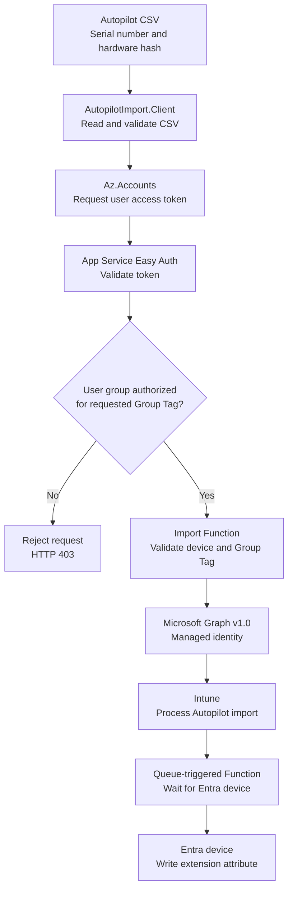

<!-- markdownlint-disable-next-line MD033 -->
<h1 align="center">Intune AutoPilot Importer</h1>

This Azure Function imports Windows Autopilot hardware hashes from a CSV file. The user authenticates to the Function API with their Entra account. Microsoft Graph is called exclusively through the system-assigned managed identity of the Function.

The client requests a Device Tag. The Function accepts it only when the server-side policy permits that tag for at least one Entra security group in the caller's token. After Intune creates the Entra device, the Function also writes the authorized tag to a configured Entra device extension attribute. The default is `extensionAttribute1`. Optionally, the Function adds the device to a configured Entra administrative unit (MAU) or restricted management administrative unit (RMAU).

## The Problem

Granting a user permission to import Windows Autopilot hardware hashes does not, by itself, restrict which Group Tag the user can assign. The standard import authorization does not require a tag, validate that a supplied tag is approved, or verify that the importing user is authorized to use that specific tag. A user who is allowed to import a hardware hash could therefore omit the Group Tag or assign a tag intended for a different device population, potentially placing the
device into an unintended dynamic group and its associated deployment profile, applications, and policies.

This project closes that authorization gap by validating the requested Group Tag server-side and allowing the import only when the authenticated user belongs to an Entra security group mapped to that tag.

## The solution

The client script reads the serial number and hardware hash from an Autopilot CSV supplied as a parameter.

- `Az.Accounts` requests a user token for the Function API.
- Azure App Service Authentication, also known as Easy Auth, validates the token.
- The Function requires a matching group-to-tag rule for the authenticated caller.
- The managed identity submits only the authorized tag to Microsoft Graph v1.0.
- Intune processes the import asynchronously.
- A queue-triggered Function waits for the Entra device and writes the tag to the configured `extensionAttribute1` through `extensionAttribute15`.



## Howto use the AutopilotImporter

### Web frontend

After installation, open the `webUrl` reported by the installer or stored in
`client.settings.json`. The page itself contains no tenant data and may load
without authentication. Import functions become available only after the user
signs in with a Microsoft Entra account.

The frontend provides the following functions:

- German and English user interface with a persistent language selection
- Microsoft Entra sign-in using Authorization Code Flow with PKCE
- Local validation of Autopilot CSV files before any data is transmitted
- Selection of only those Group Tags authorized for the signed-in user's Entra
    groups
- Parallel submission of up to three devices to the secured Function API
- Display of serial number, import ID, processing status, and error details
- Automatic monitoring of both the Intune import and the Entra device
    extension-attribute update
- Sign-out from the current Entra session

The hardware hashes are not stored by the frontend. They remain in browser
memory and are sent only to the secured Function API after validation and user
confirmation.

#### Open the Frontend During Windows OOBE

During Windows Out-of-Box Experience, press **Shift + F10** to open Command
Prompt. If PowerShell was started for collecting the hardware hash and the
prompt begins with `PS`, open the page with:

```powershell
Start-Process `
        -FilePath "${env:ProgramFiles(x86)}\Microsoft\Edge\Application\msedge.exe" `
        -ArgumentList '--inprivate', '<webUrl>'
```

If Edge is installed in the 64-bit Program Files directory instead, use:

```powershell
Start-Process `
        -FilePath "$env:ProgramFiles\Microsoft\Edge\Application\msedge.exe" `
        -ArgumentList '--inprivate', '<webUrl>'
```

Replace `<webUrl>` with the URL reported by the installer, for example
`https://<function-app-name>.azurewebsites.net/api/ui/index.html`.

In PowerShell, do not use the CMD command `start "" ...`: `start` is an alias
for `Start-Process` there and interprets the arguments differently.

The included `Start-IntuneAutopilotImporter.ps1` script automates this process.
It reads the serial number and hardware hash directly from Windows, creates
`AutopilotHWID.csv` in the current user's temporary directory, validates the
public runtime configuration of the supplied frontend URL, copies the CSV path
to the clipboard when possible, and opens Microsoft Edge in InPrivate mode:

```powershell
.\scripts\Start-IntuneAutopilotImporter.ps1 `
    -WebUrl 'https://<function-app-name>.azurewebsites.net/api/ui/index.html'
```

Omit `-WebUrl` to enter the URL interactively. The script accepts the Function
App root URL, `/api/ui`, or the complete `/api/ui/index.html` URL. It does not
upload the hardware hash automatically; paste the copied CSV path into the
frontend's file picker, sign in, review the device, and start the import.

After the script has been published to PowerShell Gallery, it can be installed
and started during OOBE with:

```powershell
Install-Script `
    -Name Start-IntuneAutopilotImporter `
    -Scope CurrentUser `
    -Force

Start-IntuneAutopilotImporter.ps1 `
    -WebUrl 'https://<function-app-name>.azurewebsites.net/api/ui/index.html'
```

The script requires an elevated Windows PowerShell 5.1 or PowerShell 7 session.
It has no dependency on `Get-WindowsAutopilotInfo`.

#### Import Workflow and Status Updates

1. Sign in with an Entra account that belongs to an authorized importer group.
2. Select or drop an Autopilot CSV containing `Device Serial Number` and
     `Hardware Hash`.
3. Select one of the Group Tags returned for the signed-in account.
4. Start the import and keep the page open while processing continues.

The frontend performs the first status request immediately after submission.
While at least one device is pending, it refreshes the status every 15 seconds.
Polling stops when every device has reached `complete` or `error`. Temporary
status-request errors are displayed and retried during the next polling cycle.

Import IDs and status rows are kept only in the current page's memory. Closing
or reloading the page ends monitoring and clears the displayed results. The
import itself continues in Azure and can be checked later with
`Get-AutopilotImportStatus -ImportId '<import-id>'`.

The PowerShell module remains available and uses the same authorization policy.

The installer deploys `AutopilotImport.Client` and a matching `client.settings.json`. The module reads the Function URL, API Application ID URI, and tenant from that file. It exports the commands used for importing and monitoring devices. (see installation)

### Import a device hash

Use the `Import-AutopilotDevice` command to submit one or more device hashes from a CSV file to Intune. Before you begin, make sure that:

- `AutopilotImport.Client` and its `client.settings.json` have been installed.
- Your account belongs to an Entra security group that is authorized for the
    Group Tag you want to use.
- The CSV contains the columns `Device Serial Number` and `Hardware Hash`.

The selected Group Tag is applied to every device in the CSV. First, validate the file locally without signing in or sending data to the Azure Function:

```powershell
Import-AutopilotDevice `
    -CsvPath '.\devices.csv' `
    -GroupTag 'PAW' `
    -ValidateOnly
```

If validation succeeds, run the same command without `-ValidateOnly`:

```powershell
Import-AutopilotDevice `
    -CsvPath '.\devices.csv' `
    -GroupTag 'PAW'
```

PowerShell signs you in with your Entra account when an access token is needed. The Azure Function then verifies that your account is authorized for the requested Group Tag before submitting each device to Intune. No Azure role, Microsoft Graph permission, client secret, or direct Intune role is required on the importing computer.

The client package also contains `Import-AutopilotDevice.ps1`. This script is a compatibility wrapper around the module command and performs the same import. Use it when a software distribution system or shortcut needs to start a `.ps1` file directly:

```powershell
pwsh -NoProfile -File .\Import-AutopilotDevice.ps1 `
    -CsvPath '.\devices.csv' `
    -GroupTag 'PAW' `
    -ConfigPath '.\client.settings.json'
```

Normally, the command reads the Function URL, API Application ID URI, and tenant from `client.settings.json`. Use `-ConfigPath` to select another configuration file. Explicit `-FunctionUrl`, `-ApiApplicationIdUri`, and `-TenantId` values override the file settings, allowing one computer to target multiple environments.

### Track Import Status

A successful request returns HTTP 202 and an `importId`. Intune processes the request asynchronously. Check the current state:

```powershell
Get-AutopilotImportStatus -ImportId '<import-id>'
```

Wait for a final end-to-end result:

```powershell
Get-AutopilotImportStatus `
    -ImportId '<import-id>' `
    -Wait
```

The default timeout is 30 minutes with a 15-second polling interval. Override these values with `-TimeoutSeconds` and `-PollIntervalSeconds`. Only `workflowStatus: complete` confirms that both the Intune import and the Entra extension-attribute update succeeded.

## Autopilot-importer management

### Change Group-to-Tag Assignments

The installing user, configured manager users or groups, and current members of the Intune RBAC role `Intune Role Administrator` may update the policy. They do not need Azure resource permissions.

Read the current policy:

```powershell
Get-AutopilotTagPolicy
```

#### Add a Group Tag Policy

`Add-AutopilotTagPolicy` adds an Entra group to the policy without replacing
the other group rules. If the group already has a rule, the command adds the
specified tags to that rule. Existing and duplicate tags are retained only
once.

Parameters:

- `-Group` accepts either the Entra group object ID or its exact display name.
    `-GroupId` and `-GroupName` are aliases for this parameter.
- `-GroupTag` accepts one or more Autopilot Group Tags. `-Tag` is an alias.
- `-Mau` optionally sets the restricted management administrative unit for the
    complete policy. The full parameter name is
    `-RestrictedManagementAdministrativeUnitName`. If omitted, the currently
    configured MAU is preserved.
- `-WhatIf` previews the update without writing it to the Azure Function.

Add a group by its exact Entra display name:

```powershell
Add-AutopilotTagPolicy `
    -Group 'Autopilot Import Operators' `
    -GroupTag 'Autopilot-Standard', 'Autopilot-Kiosk'
```

Add a group by its object ID and set the MAU:

```powershell
Add-AutopilotTagPolicy `
    -Group '11111111-1111-1111-1111-111111111111' `
    -GroupTag 'Autopilot-Privileged' `
    -Mau 'MAU-Autopilot-Devices' `
    -WhatIf
```

If more than one Entra group has the same display name, the object ID is
required. Run the command without `-WhatIf` to apply the change.

#### Remove a Group Tag Policy

`Remove-AutopilotTagPolicy` removes the complete Group Tag rule for one Entra
group. Other group rules and the configured MAU remain unchanged. The command
does not delete the group from Entra.

Parameters:

- `-Group` accepts either the Entra group object ID or its exact display name.
    `-GroupId` and `-GroupName` are aliases for this parameter.
- `-WhatIf` previews the removal without writing it to the Azure Function.

Remove a rule using its exact Entra group display name:

```powershell
Remove-AutopilotTagPolicy `
    -Group 'Obsolete Autopilot Group' `
    -WhatIf
```

Alternatively, remove it by group object ID:

```powershell
Remove-AutopilotTagPolicy `
    -Group '11111111-1111-1111-1111-111111111111'
```

If multiple Entra groups have the same display name, use the object ID. The
last policy rule cannot be removed because the Function requires at least one
group-to-tag rule. Run the command without `-WhatIf` to apply the removal.

#### Replace the Complete Group Tag Policy

Preview the complete desired policy before applying it:

```powershell
Set-AutopilotTagPolicy `
    -TagAuthorizationRule `
        '11111111-1111-1111-1111-111111111111=Autopilot-Standard,Autopilot-Kiosk', `
        '33333333-3333-3333-3333-333333333333=Autopilot-Privileged' `
    -RestrictedManagementAdministrativeUnitName 'MAU-Autopilot-Devices' `
    -WhatIf
```

Run the same command without `-WhatIf` to apply it. Omit a previous rule to remove that group. Set `-RestrictedManagementAdministrativeUnitName` to an empty string to disable automatic MAU membership.

The MAU must already exist, have `isMemberManagementRestricted` enabled, and have a unique display name. Without a configured MAU, imports continue without automatic administrative-unit membership.

### Change Group Tag Managers

Only a principal with an effective Azure `Owner` or `Contributor` assignment on the Function App, its resource group, or its subscription may change the explicit manager list:

```powershell
Update-AutopilotTagPolicyManager `
    -AddPrincipalId '44444444-4444-4444-4444-444444444444' `
    -RemovePrincipalId '33333333-3333-3333-3333-333333333333' `
    -WhatIf
```

The installing user cannot be removed. Authorization for current Intune Role Administrators remains enabled.

## Installation

### Prerequisites

- An Azure subscription and an active Intune tenant
- PowerShell 7.2 or later on the importing computer
- An Autopilot CSV containing `Device Serial Number` and `Hardware Hash`
- For deployment: `Az.Accounts`, `Az.Resources`, `Az.Storage`, `Az.Websites`, and the Bicep CLI; `-InstallMissingModules` installs missing components. See [Appendix: Bicep CLI in Restricted Environments](#appendix-bicep-cli-in-restricted-environments) when automatic downloads are blocked.
- Node.js 22 and npm for building the web frontend during installation or update
- For the one-time permission assignment: `Microsoft.Graph.Authentication`
- The appropriate Entra ID licensing for dynamic device groups

### Quick Installation Guide

1. Obtain the Azure, Entra ID, and delegated Microsoft Graph permissions listed under [Required Roles and Permissions](#required-roles-and-permissions). The installing administrator needs all applicable permissions for the complete setup.
2. Download `Intune-Autopilotimport-deployment-<version>.zip` and extract it. Open PowerShell 7 in the extracted package directory containing `Install-AutopilotImport.ps1`.
3. Start the interactive installation. Missing PowerShell modules and the Bicep CLI are installed when required:

```powershell
pwsh .\Install-AutopilotImport.ps1 -InstallMissingModules
```

1. After installation, extract the generated client module package from the current user's Documents directory into the PowerShell 7 module directory:

```powershell
$documents = [Environment]::GetFolderPath('MyDocuments')
$moduleRoot = Join-Path $documents 'PowerShell\Modules'

New-Item -Path $moduleRoot -ItemType Directory -Force | Out-Null
Expand-Archive `
    -LiteralPath (Join-Path $documents `
        'Intune-Autopilotimport-psmodule-<version>.zip') `
    -DestinationPath $moduleRoot `
    -Force
```

The archive already contains the required versioned module layout and the generated `client.settings.json`.

### Required Roles and Permissions

Azure RBAC roles, Entra directory roles, Microsoft Graph permissions, and the application role of this Function serve different purposes. They do not grant one another implicitly.
For a standard installation, one installing administrator performs the complete setup and therefore needs the applicable Azure roles, Entra directory role, and delegated Microsoft Graph permissions listed below. The scopes remain technically independent even though they are assigned to the same administrator.

| Identity | Scope | Required role or permission | Purpose |
| --- | --- | --- | --- |
| Installing administrator | Azure subscription | `Contributor` plus `Role Based Access Control Administrator` or `User Access Administrator`; alternatively `Owner` | Creates the resource group and resources, then assigns the scoped Storage data roles required for keyless access. |
| Installing administrator | Existing Azure resource group | `Contributor` plus `Role Based Access Control Administrator` or `User Access Administrator`; alternatively `Owner` | Sufficient when the resource group already exists. Equivalent subscription-level roles are then not required. |
| Installing administrator | Deployed Storage Account | `Storage Blob Data Contributor` | Uploads the initial Group Tag authorization policy using the signed-in Entra identity. Assigned automatically by the installer. |
| Installing administrator | Entra ID | Application owner, `Application Administrator`, or `Cloud Application Administrator` | Required when the app registration or enterprise application must be created or changed. An already compliant application is reused without a write. |
| Installing administrator | Microsoft Graph, delegated | `Application.ReadWrite.All`, `User.Read` | Configures the API application and records the installing user as a permanent Group Tag manager. |
| Installing administrator | Entra ID | `Privileged Role Administrator` or `Global Administrator` | Assigns the Microsoft Graph application permission to the Function App managed identity. |
| Installing administrator | Microsoft Graph, delegated | `Application.Read.All`, `AppRoleAssignment.ReadWrite.All` | Resolves the Microsoft Graph service principal and creates the app-role assignment for the managed identity. Admin consent is required. |
| Function App managed identity | Microsoft Graph, application | `DeviceManagementServiceConfig.ReadWrite.All` | Imports Windows Autopilot device identities. |
| Function App managed identity | Microsoft Graph, application | `DeviceManagementRBAC.Read.All` | Checks current membership of the Intune RBAC role `Intune Role Administrator` for Group Tag management requests. |
| Function App managed identity | Microsoft Graph, application | `Device.ReadWrite.All` | Writes the authorized Group Tag to the configured Entra device extension attribute after the device is created. |
| Function App managed identity | Microsoft Graph, application | `AdministrativeUnit.ReadWrite.All` | Resolves the optional MAU and adds the imported Entra device as a member. |
| Function App managed identity | Deployed Storage Account | `Storage Blob Data Owner` | Provides keyless host storage access and reads or updates the Group Tag authorization policy. Assigned automatically by the installer. |
| Function App managed identity | Deployed Storage Account | `Storage Queue Data Contributor` | Queues and retries the Entra device extension attribute update while Autopilot processing is incomplete. Assigned automatically by the installer. |
| Importing user or group | Function API | Matching group-to-tag rule | Allows importing devices with only the tags assigned to the caller's Entra security group. |
| Group Tag manager | Function API | Installer, configured manager user/group, or `Intune Role Administrator` | Reads and replaces the group-to-tag policy without Azure resource permissions. |
| Manager-list administrator | Azure Function App | `Owner` or `Contributor` at Function or ancestor scope | Adds or removes explicitly configured manager users and groups. The management script rejects other roles. |

The standard installer creates three role assignments scoped to the deployed Storage Account. The installing user receives `Storage Blob Data Contributor`, and the Function managed identity receives `Storage Blob Data Owner` and
`Storage Queue Data Contributor`. The installer therefore needs both resource deployment permissions and
`Microsoft.Authorization/roleAssignments/write`. If organizational policy uses custom Azure roles, they must also allow Function ZIP publishing for the resource types defined in `infra/main.bicep`.

The Consumption-plan deployment requires the Storage Account data endpoint to permit public network access. Blob public access and shared-key authentication remain disabled; both the installer and Function authenticate with Entra ID.
If Azure Policy requires `PublicNetworkAccess=Disabled`, this architecture requires a VNet-integrated hosting plan, Storage Private Endpoints, and private DNS instead of the standard Consumption template.

Importing users require no Azure subscription role, Entra directory role, Microsoft Graph permission, or direct Intune administrative role. Authorization is provided by the configured group-to-tag rule. The Function's managed
identity holds the Intune-related Graph permissions independently of the user.

Do not grant other principals Azure roles that can modify the Function App's application settings or deployed code. Such permissions can change the manager policy outside the provided script and therefore bypass its strict
`Owner`/`Contributor` check.

### 1. Entra Application for the Function API

By default, the installer searches the selected tenant for an app registration named `Autopilot Import API`. If it does not exist, the installer creates and configures it automatically. During application setup, Microsoft Graph requests `Application.ReadWrite.All` and `User.Read`. The separate managed-identity permission step requests `Application.Read.All` and `AppRoleAssignment.ReadWrite.All`.

The installer compares the existing application with the desired configuration before writing. A user with read access can therefore reuse an already compliant application. Application ownership or an application administrator directory
role is required only when the application actually needs to be created or updated.

These delegated permissions apply only during installation. Function users do not receive them. The managed identity receives `DeviceManagementServiceConfig.ReadWrite.All`, `Device.ReadWrite.All`, `AdministrativeUnit.ReadWrite.All`, and the read-only `DeviceManagementRBAC.Read.All` permission.

The installer configures:

- A single-tenant app registration
- Application ID URI `api://<Application-Client-ID>`
- Delegated scope `DeviceHash.Import`
- Pre-authorization for Microsoft Azure PowerShell
- Security-group claims for endpoint-level authorization
- An enterprise application that allows authenticated tenant users to reach endpoint-level authorization
- A separate single-tenant SPA registration named `Autopilot Import Web`
- Authorization Code Flow with PKCE for the SPA, without a client secret
- SPA preauthorization for the `DeviceHash.Import` scope and the exact deployed frontend redirect URI

Use `-EntraClientId '<Client-ID>'` to select a specific existing application. Without this parameter, the installer searches by `-EntraApplicationName`, which defaults to `Autopilot Import API`.

#### Manual Alternative

Create a single-tenant app registration in the Entra admin center, for example `Autopilot Import API`.

Under **Expose an API**:

- Application ID URI: `api://<Application-Client-ID>`
- Delegated scope: `DeviceHash.Import`
- Consent: administrators only
- Authorized client application: `1950a258-227b-4e31-a9cf-717495945fc2` (Microsoft Azure PowerShell)
- Select the `DeviceHash.Import` scope for that client

Then configure the enterprise application:

1. Set **Assignment required?** to **No**.
2. Keep tenant access restricted through Easy Auth and the Function's endpoint-level policies.

The delegated scope allows Azure PowerShell to request a token for the API. It does not grant the user Microsoft Graph or Intune permissions.

### 2. Deploy Azure Resources

The installer prompts for all values that were not supplied as parameters, validates the Bicep template, deploys the resources, assigns the Graph permission, publishes the Function code, and verifies that Easy Auth rejects anonymous requests with HTTP 401:

```powershell
pwsh .\Install-AutopilotImport.ps1 -InstallMissingModules
```

To sign out a cached Microsoft Graph account and sign in again as the installing administrator without changing the Azure PowerShell account, add `-ForceGraphSignIn`. The installer uses device-code authentication so the operator can open the sign-in page in the appropriate browser profile:

```powershell
pwsh .\Install-AutopilotImport.ps1 `
    -InstallMissingModules `
    -ForceGraphSignIn
```

Assigning Microsoft Graph application permissions requires a signed-in user with Application Administrator, Cloud Application Administrator, or Privileged Role Administrator in the target tenant. After a failed installation, retry
only the idempotent permission assignment with the managed identity object ID reported by the deployment:

```powershell
.\scripts\Grant-ManagedIdentityGraphPermission.ps1 `
    -ManagedIdentityObjectId '<Function-managed-identity-object-ID>' `
    -TenantId '<Tenant-ID>' `
    -ForceGraphSignIn
```

After the Azure resources are deployed, the installer creates a portable client tools package. It asks for the destination and suggests
`Documents\PowerShell\Scripts\AutopilotImport`. The package contains:

- `Modules\AutopilotImport.Client\<version>\AutopilotImport.Client.psd1`
- `Modules\AutopilotImport.Client\<version>\AutopilotImport.Client.psm1`
- `Modules\AutopilotImport.Client\<version>\AutopilotImport.psm1`
- `Modules\AutopilotImport.Client\<version>\client.settings.json`
- `scripts\Import-AutopilotDevice.ps1`
- `scripts\Set-TagAuthorizationPolicy.ps1`
- `scripts\Set-TagPolicyManagers.ps1`

The settings file contains the import and management URLs, API Application ID URI, Tenant ID, Subscription ID, resource group, and Function App name. It contains no credentials. The module loads these values automatically, while
explicitly supplied parameters take precedence. The scripts are thin compatibility wrappers over the module commands.

During installation and update, the installer creates `Intune-Autopilotimport-psmodule-<version>.zip` in the current user's Documents directory. An existing archive with the same version is replaced. The ZIP contains the current versioned PowerShell modules and `client.settings.json`, with the folder layout required by PowerShell module autoloading. Transfer the archive to another computer and extract it into the current user's PowerShell module directory:

```powershell
$moduleRoot = Join-Path `
    ([Environment]::GetFolderPath('MyDocuments')) `
    'PowerShell\Modules'
New-Item -Path $moduleRoot -ItemType Directory -Force | Out-Null
Expand-Archive `
    -LiteralPath (Join-Path `
        ([Environment]::GetFolderPath('MyDocuments')) `
        'Intune-Autopilotimport-psmodule-<version>.zip') `
    -DestinationPath $moduleRoot `
    -Force
```

After extraction, commands such as `Import-AutopilotDevice` are available through PowerShell module autoloading. The user does not need to run `Import-Module` first. PowerShell 7.2 or later and the required Az modules must still be installed on the destination computer.

Each installation writes an activity transcript to the current user's temporary directory. The file name uses the pattern `Intune-Autopilotimport-install-<timestamp>-<unique-id>.log`. The console displays the full path when setup starts. If installation stops with an error, the transcript is closed before the log is extended with the complete PowerShell error record, exception properties, and script stack trace.

Import the newest installed module version from a custom tools directory:

```powershell
$module = Get-ChildItem `
    'C:\Tools\AutopilotImport\Modules\AutopilotImport.Client\*\AutopilotImport.Client.psd1' |
    Sort-Object { [version] $_.Directory.Name } -Descending |
    Select-Object -First 1
Import-Module $module.FullName
```

The module exports `New-AutopilotClientConfiguration`, `Import-AutopilotDevice`, `Get-AutopilotImportStatus`,
`Get-AutopilotTagPolicy`,
`Add-AutopilotTagPolicy`, `Remove-AutopilotTagPolicy`,
`Set-AutopilotTagPolicy`, `Update-AutopilotTagPolicyManager`,
`Add-AutopilotTagPolicyManager`, and `Remove-AutopilotTagPolicyManager`.

If `client.settings.json` is missing for an existing deployment, create it with
the client module:

```powershell
New-AutopilotClientConfiguration `
    -SubscriptionId '<Subscription-ID>' `
    -ResourceGroupName 'rg-autopilot-import' `
    -TenantId '<Tenant-ID>' `
    -FunctionAppName '<Function-App-Name>'
```

By default, the file is created as `client.settings.json` in the current
directory. Use `-OutputPath 'C:\Configuration'` to select another directory,
and `-Force` to replace an existing file. The command reads the API Application
ID URI from the deployed Function App's Easy Auth configuration and prints the
module directory into which the file must be copied. The final file must be
named `client.settings.json` next to `AutopilotImport.Client.psm1`, normally at:

```text
Documents\PowerShell\Modules\AutopilotImport.Client\<version>\client.settings.json
```

The installer prompts for:

- Azure Subscription ID
- Entra Tenant ID
- Azure Resource Group
- Azure region
- Globally unique Function App name, with a generated name proposed by default
- Destination directory for the operational PowerShell scripts
- Entra device extension attribute for the authorized Group Tag; the default is `extensionAttribute1`
- Optional display name of an Entra restricted management administrative unit
- Entra group object IDs
- Allowed Device Tags for each group

Function App names must contain 2-60 letters, digits, or hyphens and must start and end with a letter or digit. The installer rejects an invalid `-FunctionAppName`; in interactive mode it asks again until the name is valid.

The Client ID is taken automatically from the existing or newly created app registration.

Group-to-tag rules are requested repeatedly in interactive mode. One group can receive multiple tags, and the same tag can be assigned to multiple groups.

For a non-interactive installation, pass all values as parameters:

```powershell
pwsh .\Install-AutopilotImport.ps1 `
    -SubscriptionId '<Subscription-ID>' `
    -TenantId '<Tenant-ID>' `
    -ResourceGroupName 'rg-autopilot-import' `
    -ResourceGroupTags @{ Environment = 'Production'; Owner = 'Endpoint Team' } `
    -Location 'westeurope' `
    -FunctionAppName '<globally-unique-name>' `
    -DeviceTagExtensionAttribute 'extensionAttribute1' `
    -TagAuthorizationRule `
        '11111111-1111-1111-1111-111111111111=Autopilot-Standard,Autopilot-Kiosk', `
        '22222222-2222-2222-2222-222222222222=Autopilot-Privileged' `
    -RestrictedManagementAdministrativeUnitName 'MAU-Autopilot-Devices' `
    -TagManagerPrincipalId `
        '33333333-3333-3333-3333-333333333333' `
    -ClientToolsPath 'C:\Tools\AutopilotImport' `
    -InstallMissingModules `
    -Confirm:$false
```

`-ResourceGroupTags` accepts an optional PowerShell hashtable. Tags are included in the request that creates a new resource group, allowing tag-enforcement policies to succeed. For an existing resource group, the installer merges the requested tags while leaving tags with other names unchanged.

Use `-WhatIf` for a safe preview that displays the configuration and planned action without creating Azure or Entra resources:

```powershell
pwsh .\Install-AutopilotImport.ps1 `
    -SubscriptionId '<Subscription-ID>' `
    -TenantId '<Tenant-ID>' `
    -ResourceGroupName 'rg-autopilot-import' `
    -Location 'westeurope' `
    -FunctionAppName '<globally-unique-name>' `
    -TagAuthorizationRule `
        '11111111-1111-1111-1111-111111111111=Autopilot-Standard' `
    -WhatIf
```

#### Azure DevOps Pipeline

The repository contains `azure-pipelines.yml`. Pull requests run the Pester tests. A successful run on `main` additionally deploys the Bicep template and Function ZIP through an Azure Resource Manager service connection. The generated `client.settings.json` is published as the pipeline artifact `autopilot-import-client-settings`.

Create an Azure DevOps service connection that uses workload identity federation. Grant its service principal `Contributor` on the target resource group. If the pipeline must create the resource group, grant `Contributor` at subscription scope instead. The pipeline service principal does not require Microsoft Graph permissions.

Create a variable group named `autopilot-import-deployment` with these values:

| Variable | Example | Purpose |
| --- | --- | --- |
| `azureServiceConnection` | `sc-autopilot-import` | Name of the Azure Resource Manager service connection |
| `subscriptionId` | `00000000-0000-0000-0000-000000000000` | Target Azure subscription |
| `tenantId` | `11111111-1111-1111-1111-111111111111` | Entra tenant |
| `resourceGroupName` | `rg-autopilot-import` | Target resource group |
| `location` | `westeurope` | Azure region |
| `functionAppName` | `func-autopilot-contoso` | Globally unique Function App name |
| `entraClientId` | `22222222-2222-2222-2222-222222222222` | Client ID of the preconfigured API app registration |
| `webClientId` | `55555555-5555-5555-5555-555555555555` | Client ID of the preconfigured SPA app registration |
| `installerPrincipalId` | `33333333-3333-3333-3333-333333333333` | Object ID of the user or group that remains a permanent Group Tag manager |
| `tagAuthorizationRulesJson` | `["44444444-4444-4444-4444-444444444444=Standard,Kiosk"]` | JSON array containing the complete group-to-tag policy |
| `tagManagerPrincipalIdsJson` | `[]` | JSON array of additional manager user or group object IDs |

Authorize the pipeline to use this variable group. None of these values is a credential; authentication is provided by workload identity federation.

The Entra API application and the managed identity's Microsoft Graph permissions remain intentionally outside the pipeline because they require privileged tenant permissions that should not be assigned to a deployment service connection.

Before the first pipeline deployment, create or configure the Entra API and SPA applications once from an administrator workstation. Supply their returned client IDs through `entraClientId` and `webClientId`:

```powershell
Install-Module Microsoft.Graph.Authentication -Scope CurrentUser
$entraApplication = .\scripts\Ensure-EntraApiApplication.ps1 `
    -TenantId '<Tenant-ID>' `
    -DisplayName 'Autopilot Import API' `
    -Confirm:$false
$webApplication = .\scripts\Ensure-EntraWebApplication.ps1 `
    -TenantId '<Tenant-ID>' `
    -ApiApplicationObjectId $entraApplication.ApplicationObjectId `
    -ApiClientId $entraApplication.ClientId `
    -ApiScopeId $entraApplication.ScopeId `
    -RedirectUri 'https://<function-app-name>.azurewebsites.net/api/ui/index.html' `
    -Confirm:$false
$entraApplication, $webApplication
```

After the first pipeline deployment has created the Function managed identity, a Privileged Role Administrator or Global Administrator runs the idempotent permission script once:

```powershell
Connect-AzAccount -Tenant '<Tenant-ID>' -Subscription '<Subscription-ID>'
$function = Get-AzWebApp `
    -ResourceGroupName 'rg-autopilot-import' `
    -Name '<function-app-name>'

.\scripts\Grant-ManagedIdentityGraphPermission.ps1 `
    -ManagedIdentityObjectId $function.Identity.PrincipalId
```

Subsequent pipeline deployments update infrastructure, policies, and Function code without repeating either privileged Entra operation. Configure approvals and checks on the Azure DevOps environment `autopilot-import` when production deployments require manual authorization.

#### Update an Existing Deployment

Download or clone the desired release, then run the update script from its project directory. Preview the resolved deployment and planned installer action first:

```powershell
.\Update-AutopilotImport.ps1 -WhatIf
```

Apply the update:

```powershell
.\Update-AutopilotImport.ps1
```

To run the update without the execution confirmation, use `-Force`:

```powershell
.\Update-AutopilotImport.ps1 -Force
```

`-WhatIf` still takes precedence when combined with `-Force` and does not perform the update.

By default, the script selects the newest installed `client.settings.json` under `Documents\PowerShell\Scripts\AutopilotImport`. Select another installed deployment explicitly when required:

```powershell
.\Update-AutopilotImport.ps1 `
    -ConfigPath 'C:\Tools\AutopilotImport\Modules\AutopilotImport.Client\<version>\client.settings.json'
```

The script preserves the existing Function App name, region, API application, Group Tag authorization rules, configured Group Tag managers, client tools path, Device Tag extension attribute, and optional MAU. It then reuses the idempotent
installer to update Azure resources, required permissions, Function code, and the versioned client package.

Each invocation creates a new log file. An update writes its activity to `Intune-Autopilotimport-update-<timestamp>-<unique-id>.log`, and the installer invoked by the update writes its own `Intune-Autopilotimport-install-<timestamp>-<unique-id>.log` in the current user's temporary directory. If either script stops with an error, its transcript is closed before detailed error and stack information is appended to avoid file-lock conflicts.

The updating administrator needs the same Azure and Entra permissions as an installer. Before prompting for confirmation, the update and installation scripts query effective ARM permissions at the target resource group or subscription scope. Deployment requires `Owner`, or `Contributor` together with `Role Based Access Control Administrator` or `User Access Administrator`, because the Bicep template also maintains Storage role assignments. Missing actions produce a concise console error; the complete permission lookup or deployment error remains in the temporary setup log.

Reading and preserving the Function configuration requires `Microsoft.Web/sites/config/list/action`, which is included in Azure `Contributor` and `Owner`. The caller must also be authorized to read the Group Tag policy through the Function management API. Use `-InstallMissingModules` when local prerequisites may be missing. The installer skip switches are also available for separated administrative workflows.

#### Deployment Package

GitHub Actions builds a versioned deployment package for every push to `main` and every pull request targeting `main`. The workflow runs the Pester suite first and then publishes `Intune-Autopilotimport-deployment-<version>` as a workflow artifact with a retention period of 30 days. The downloaded artifact contains the ZIP file of the same name.

The package contains `README.md`, the installer and updater, Function runtime files, Bicep infrastructure, operational scripts, source modules, configuration examples, and project version information. Local or generated configuration such as `client.settings.json` and `local.settings.json`, tests, logs, repository metadata, and development helpers such as `New-DeploymentPackage.ps1`, `New-SyntheticAutopilotTestCsv.ps1`, and `Update-ProjectVersion.ps1` are excluded.

The workflow is prepared on `dev` but normal pushes to `dev` do not run it. It can be tested there manually with the GitHub Actions `workflow_dispatch` trigger or built locally:

```powershell
.\scripts\New-DeploymentPackage.ps1
```

The local package is written to `artifacts\Intune-Autopilotimport-deployment-<version>.zip` by default.

#### Manual Bicep Deployment

The individual commands remain available for troubleshooting or manual installation:

```powershell
Connect-AzAccount

$resourceGroupName = 'rg-autopilot-import'
$location = 'westeurope'
$functionAppName = '<globally-unique-name>'
$entraClientId = '<Application-Client-ID>'
$webClientId = '<Web-Application-Client-ID>'
$tagPolicy = @(
    @{
        groupId = '11111111-1111-1111-1111-111111111111'
        tags = @('Autopilot-Standard')
    }
) | ConvertTo-Json -Depth 4 -Compress
$managerPolicy = @{
    installerPrincipalId = '<installing-user-object-id>'
    additionalPrincipalIds = @()
    allowIntuneRoleAdministrators = $true
} | ConvertTo-Json -Depth 4 -Compress

New-AzResourceGroup `
    -Name $resourceGroupName `
    -Location $location

$deployment = New-AzResourceGroupDeployment `
    -ResourceGroupName $resourceGroupName `
    -TemplateFile .\infra\main.bicep `
    -functionAppName $functionAppName `
    -entraClientId $entraClientId `
    -webClientId $webClientId `
    -tagAuthorizationPolicy $tagPolicy `
    -managerAuthorizationPolicy $managerPolicy
```

The template enables HTTPS, Easy Auth, Application Insights, and a system-assigned managed identity. Unauthenticated API requests are rejected with HTTP 401 before the Function code runs. Only `/` and `/api/ui/*` are excluded: the root returns an HTTP redirect to the frontend, while the static sign-in page and its public runtime configuration can load without authentication. No import or policy data is exposed through these paths.

### 3. Assign the Graph Permission

This action requires an administrator who can assign app roles. The managed identity receives `DeviceManagementServiceConfig.ReadWrite.All`, `DeviceManagementRBAC.Read.All`, `Device.ReadWrite.All`, and `AdministrativeUnit.ReadWrite.All`.

```powershell
Install-Module Microsoft.Graph.Authentication -Scope CurrentUser

.\scripts\Grant-ManagedIdentityGraphPermission.ps1 `
    -ManagedIdentityObjectId $deployment.Outputs.managedIdentityObjectId.Value
```

### 4. Publish the Function Code

The ZIP archive must contain `host.json` at its root:

```powershell
Push-Location .\web
npm ci
npm run build
Pop-Location

$package = Join-Path $PWD 'autopilot-import.zip'
Compress-Archive `
    -Path .\host.json, .\proxies.json, .\requirements.psd1, .\profile.ps1, .\ImportDevice, .\GetAuthorizedTags, .\ManageTagPolicy, .\ProcessDeviceAttribute, .\WebFrontend, .\src `
    -DestinationPath $package `
    -Force

Publish-AzWebApp `
    -ResourceGroupName $resourceGroupName `
    -Name $functionAppName `
    -ArchivePath $package `
    -Force
```

Managed Dependencies can take several minutes to make `Az.Accounts` available after the first start.

### 5. Distribute the Import Client to Additional PCs

The Azure Function itself remains in Azure. An importing PC needs only:

- PowerShell 7.2 or later (`pwsh`)
- `scripts\Import-AutopilotDevice.ps1`
- the PowerShell module `Az.Accounts`
- a configured `client.settings.json`
- HTTPS access to Microsoft Entra sign-in and the Function App

The `src\AutopilotImport` module, Function folders, Bicep template, deployment scripts, and `Microsoft.Graph.Authentication` are not required on importing PCs. `Microsoft.Graph.Authentication` is used only for administrative setup.

For a PC with access to the PowerShell Gallery, install `Az.Accounts` for the current user:

```powershell
Install-Module Az.Accounts `
        -Scope CurrentUser `
        -Repository PSGallery `
        -Force
```

For a managed installation available to all users, run the following command as an administrator or deploy it through the organization's software management system:

```powershell
Install-Module Az.Accounts `
        -Scope AllUsers `
        -Repository PSGallery `
        -Force
```

In networks without direct PowerShell Gallery access, download the module and its dependencies on a connected staging PC:

```powershell
$packagePath = 'C:\AutopilotImportPackage'
New-Item -ItemType Directory -Path "$packagePath\Modules" -Force | Out-Null

Save-Module Az.Accounts `
        -Path "$packagePath\Modules" `
        -Repository PSGallery `
        -Force

Copy-Item .\scripts\Import-AutopilotDevice.ps1 `
        -Destination $packagePath
Copy-Item .\client.settings.json `
        -Destination $packagePath
```

Copy the package to each target PC and place every directory below `Modules` in a PowerShell 7 module path. For a per-machine installation, use:

```powershell
$packagePath = 'C:\AutopilotImportPackage'
$modulePath = "$env:ProgramFiles\PowerShell\Modules"

Get-ChildItem "$packagePath\Modules" -Directory | ForEach-Object {
        Copy-Item $_.FullName -Destination $modulePath -Recurse -Force
}
```

This copy step requires local administrator rights. For a per-user installation, use `$HOME\Documents\PowerShell\Modules` instead. Distribute the same package with Microsoft Intune, Configuration Manager, Group Policy, or
another software deployment system when many PCs must be maintained. Sign the PowerShell script with a trusted code-signing certificate when the target environment enforces `AllSigned` or `RemoteSigned`; do not weaken the execution
policy as part of deployment.

When Azure DevOps performs the Function deployment, download the `autopilot-import-client-settings` pipeline artifact and distribute its `client.settings.json` together with the import script. The file contains no password, client secret, or access token, but it selects a tenant and Function environment and should therefore be managed as environment-specific
configuration.

The configuration must contain these values:

```json
{
    "functionUrl": "https://<function-app>.azurewebsites.net/api/devices/import",
    "managementUrl": "https://<function-app>.azurewebsites.net/api/management/tag-policy",
    "apiApplicationIdUri": "api://<application-client-id>",
    "tenantId": "<tenant-id>"
}
```

- `functionUrl` is the complete HTTPS import endpoint, including
    `/api/devices/import`.
- `managementUrl` is used only by the policy-management script and may remain
    in the shared configuration.
- `apiApplicationIdUri` must match the Application ID URI exposed by the Entra
    API application and the Easy Auth audience.
- `tenantId` is the Entra tenant in which users authenticate.

Store `client.settings.json` next to `Import-AutopilotDevice.ps1`, or keep it in a centrally managed location and pass its path with `-ConfigPath`. When the script remains in the repository layout under `scripts`, its default is the repository-root `client.settings.json`. Explicit `-FunctionUrl`, `-ApiApplicationIdUri`, and `-TenantId` parameters override file values, which is useful when one PC targets multiple environments.

The client machine needs PowerShell 7.2 or later and `Az.Accounts`. Managing the explicit manager list additionally requires `Az.Resources` and `Az.Websites`. The project module dependency is included in the installed package.

### 6. Use a Friendly DNS Alias for the Web Frontend

The web frontend can use a public, friendly subdomain such as
`autopilot.contoso.com` instead of the generated Function hostname. The final
URL is then:

```text
https://autopilot.contoso.com/api/ui/index.html
```

DNS alone is not sufficient. The hostname must also be assigned to the Function
App, secured with a TLS certificate, and registered as an Entra SPA redirect
URI. The Function App uses a Consumption plan, for which a custom subdomain is
mapped with a CNAME record.

1. In the Azure portal, open the deployed Function App and select
    **Settings > Custom domains > Add custom domain**.
2. Enter the public subdomain, for example `autopilot.contoso.com`, and use the
    DNS values shown by Azure to create these records at the DNS provider:

    | Type | Name | Value |
    | --- | --- | --- |
    | CNAME | `autopilot` | `<function-app-name>.azurewebsites.net` |
    | TXT | `asuid.autopilot` | The **Custom Domain Verification ID** shown by Azure |

    The TXT record is strongly recommended because it proves ownership and
    protects against subdomain takeover. Do not include `https://` or a URL path
    in either DNS record.
3. Wait for DNS propagation, select **Validate**, and add the custom domain to
    the Function App. A successful DNS lookup by itself does not complete this
    Azure hostname association.
4. Configure an **SNI SSL** binding for the custom hostname. Select an App
    Service Managed Certificate when that option is available, or bind a valid
    uploaded or Key Vault certificate. Do not distribute the friendly URL until
    Azure shows the custom domain as **Secured** and HTTPS opens without a
    certificate warning.
5. In **Microsoft Entra ID > App registrations**, open the separate
    **Autopilot Import Web** application. Under **Authentication > Single-page
    application**, add this exact redirect URI:

    ```text
    https://autopilot.contoso.com/api/ui/index.html
    ```

    Redirect URIs are case-sensitive and must match the complete URL returned by
    `/api/ui/config`. Keep the existing
    `https://<function-app-name>.azurewebsites.net/api/ui/index.html` redirect URI
    until the new hostname has been tested and all bookmarks have been migrated.
    The API Application ID URI and audience, such as `api://<application-client-id>`,
    do not change.
6. Test the configuration in this order:

    - `https://autopilot.contoso.com/api/ui/config` returns the frontend
      configuration and uses `https://autopilot.contoso.com` for its URLs.
    - `https://autopilot.contoso.com/api/ui/index.html` loads without a TLS
      warning.
    - Interactive sign-in succeeds and a test CSV can be submitted.

The OOBE helper can now open the friendly URL directly:

```powershell
.\scripts\Start-IntuneAutopilotImporter.ps1 `
          -WebUrl 'https://autopilot.contoso.com/api/ui/index.html'
```

The endpoint values in `client.settings.json` may continue to use the default
`azurewebsites.net` hostname. The friendly alias is required there only when
the PowerShell client should also call the APIs through that hostname.

For background and current platform restrictions, see the Microsoft guidance
for [mapping an existing custom domain](https://learn.microsoft.com/azure/app-service/app-service-web-tutorial-custom-domain),
[binding a TLS certificate](https://learn.microsoft.com/azure/app-service/configure-ssl-bindings),
and [configuring SPA redirect URIs](https://learn.microsoft.com/entra/identity-platform/reply-url).

## Troubleshooting

### PowerShell Module or Client Configuration Does Not Work

Run all commands in PowerShell 7 (`pwsh`), not Windows PowerShell 5.1. Confirm
the active version first:

```powershell
$PSVersionTable.PSVersion
```

The major version must be `7`, and the version must be `7.2` or later. Check
whether PowerShell can find the client module and which version it selects:

```powershell
$module = Get-Module -ListAvailable AutopilotImport.Client |
    Sort-Object Version -Descending |
    Select-Object -First 1

$module | Format-List Name, Version, ModuleBase, Path
```

If no module is returned, extract the portable client package into a
PowerShell 7 module directory. For a per-user installation, the resulting
layout must be:

```text
Documents\PowerShell\Modules\AutopilotImport.Client\<version>\AutopilotImport.Client.psd1
Documents\PowerShell\Modules\AutopilotImport.Client\<version>\AutopilotImport.Client.psm1
Documents\PowerShell\Modules\AutopilotImport.Client\<version>\AutopilotImport.psm1
Documents\PowerShell\Modules\AutopilotImport.Client\<version>\client.settings.json
```

Inspect the active module paths if the module is installed elsewhere:

```powershell
$env:PSModulePath -split [IO.Path]::PathSeparator
```

When the module exists but commands are missing or an older version is loaded,
remove the loaded copy and import the newest manifest explicitly:

```powershell
Remove-Module AutopilotImport.Client -Force -ErrorAction SilentlyContinue
Import-Module $module.Path -Force -Verbose
Get-Command -Module AutopilotImport.Client
```

Install the required authentication dependency when `Get-AzContext`,
`Connect-AzAccount`, or `Get-AzAccessToken` is unavailable:

```powershell
Install-Module Az.Accounts `
    -Scope CurrentUser `
    -Repository PSGallery `
    -Force
```

The default configuration must be named `client.settings.json` and must be in
the same directory as `AutopilotImport.Client.psm1`. Check the file selected by
the newest module version:

```powershell
$settingsPath = Join-Path $module.ModuleBase 'client.settings.json'
Test-Path $settingsPath
Get-Content $settingsPath -Raw | ConvertFrom-Json |
    Format-List functionUrl, managementUrl, apiApplicationIdUri, tenantId,
        subscriptionId, resourceGroupName, functionAppName
```

If the file is missing, invalid JSON, or points to the wrong Function App,
recreate it from the deployed Azure resources. The signed-in account must be
able to read the Function App's Easy Auth configuration:

```powershell
$createdSettings = New-AutopilotClientConfiguration `
    -SubscriptionId '<Subscription-ID>' `
    -ResourceGroupName '<Resource-Group-Name>' `
    -TenantId '<Tenant-ID>' `
    -FunctionAppName '<Function-App-Name>' `
    -OutputPath $PWD `
    -Force

Copy-Item `
    -LiteralPath $createdSettings.FullName `
    -Destination $module.ModuleBase `
    -Force
```

After replacing the configuration, reload the module so subsequent commands
use the new file:

```powershell
Remove-Module AutopilotImport.Client -Force -ErrorAction SilentlyContinue
Import-Module $module.Path -Force
```

To test a configuration before copying it into the module directory, pass it
explicitly to a read-only command:

```powershell
Get-AutopilotTagPolicy -ConfigPath $createdSettings.FullName
```

If multiple module versions are installed, each version has its own
`client.settings.json`. Update the directory reported by `$module.ModuleBase`,
or remove obsolete versions to prevent PowerShell from loading an unexpected
configuration. Do not place `client.settings.json.example` in the module
directory without replacing all placeholder values and renaming it to
`client.settings.json`.

## Appendix: Developer Information

### Build the Frontend Locally

The frontend source is located under `web`, while the Azure Function that
serves it is located under `WebFrontend`. Build and test it with:

```powershell
Set-Location .\web
npm ci
npm run check
```

`npm run check` executes the frontend unit tests and creates the production
bundle under `WebFrontend\wwwroot`. The generated `web\node_modules`,
`web\tsconfig.tsbuildinfo`, and `WebFrontend\wwwroot` paths are intentionally
ignored by Git and are recreated during a local build or deployment.

### Publish the OOBE Helper to PowerShell Gallery

The standalone gallery script is
`scripts\Start-IntuneAutopilotImporter.ps1`. Its `PSScriptInfo` version is
updated together with the project version by
`scripts\Update-ProjectVersion.ps1`. Validate its metadata before publishing:

```powershell
Test-ScriptFileInfo `
    -Path .\scripts\Start-IntuneAutopilotImporter.ps1
```

Test the complete workflow against a non-production Function App before
publishing. Then publish it with a PowerShell Gallery API key entered directly
in the interactive PowerShell session; do not store the key in source control:

```powershell
Publish-Script `
    -Path .\scripts\Start-IntuneAutopilotImporter.ps1 `
    -Repository PSGallery `
    -NuGetApiKey (Read-Host 'PowerShell Gallery API key')
```

### Branch Promotion Policy

Changes to `main` must be promoted through a pull request whose source branch is `dev`. The `Main promotion policy` GitHub Actions workflow rejects pull requests to `main` from any other branch.

To enforce this policy, configure a GitHub ruleset or branch protection rule for `main` with these settings:

- Require a pull request before merging.
- Require the status check `Validate dev promotion` to pass before merging.
- Block force pushes and branch deletion.
- Do not allow direct-push bypasses, or restrict bypass permission to designated repository administrators for emergencies.

The workflow validates the pull request source, while the server-side rule prevents direct pushes from bypassing that validation.

### Tests

```powershell
Invoke-Pester .\tests\AutopilotImport.Tests.ps1
```

The tests cover Group Tag authorization, manager users and groups, the strict Owner/Contributor boundary, installer rule parsing, and invalid hardware hashes.

### Versioning

The project version is stored in `VERSION` and follows `1.0.<yyyyMMdd>.<counter>`, for example `1.0.20260811.1`. Every PowerShell script, module, and data file contains the same `# Project-Version:` marker.
The canonical author is stored in `AUTHOR`, and the same files contain the matching `# Author: andreas.lucas@microsoft.com (aka Kili)` marker.

After commits are pushed to `main`, the GitHub workflow increments the counter by the number of commits in that push and commits the synchronized version entries. On a new UTC date, the counter starts at `1`. The workflow-generated version commit does not trigger another increment.

For a local manual increment, run:

```powershell
.\scripts\Update-ProjectVersion.ps1
```

### Operations and Security

- Application Insights logs the correlation ID, import ID, serial number, and object ID of the calling user.
- Hardware hashes and access tokens are not logged.
- Graph error details are not returned to the client.
- Allowed tags are stored in a private Storage blob and changed through the protected management endpoint. Shared-key access is not required; the installer and Function use their Entra identities.
- The explicit manager list remains in `MANAGER_AUTHORIZATION_POLICY` and can be changed only through Azure by an effective Owner or Contributor.
- Tag authorization is denied when the Entra group claim is missing. This also applies to group overage for users with a very large number of group memberships.

## Appendix: Bicep CLI in Restricted Environments

The installer uses `winget install Microsoft.Bicep` when `-InstallMissingModules` is specified. If application control, proxy settings, or network restrictions prevent that automatic download, install the standalone Bicep CLI before starting the deployment. Azure PowerShell requires a separately installed `bicep` command; the copy managed internally by Azure CLI is not available to Azure PowerShell.

Use the official [Bicep installation documentation](https://learn.microsoft.com/azure/azure-resource-manager/bicep/install) and download one of these Windows assets from the [latest Bicep release](https://github.com/Azure/bicep/releases/latest):

- `bicep-setup-win-x64.exe`: run the installer. It installs Bicep for the current user and adds it to the user `PATH` without requiring local administrator rights.
- `bicep-win-x64.exe`: use this standalone binary when installers are blocked. Download it on an approved connected computer, transfer it to the deployment computer, rename it to `bicep.exe`, and place it in a directory permitted by application control and included in `PATH`.

Close and reopen PowerShell after changing the persistent `PATH`, then verify the installation:

```powershell
Get-Command bicep
bicep --version
```
