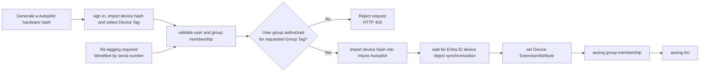
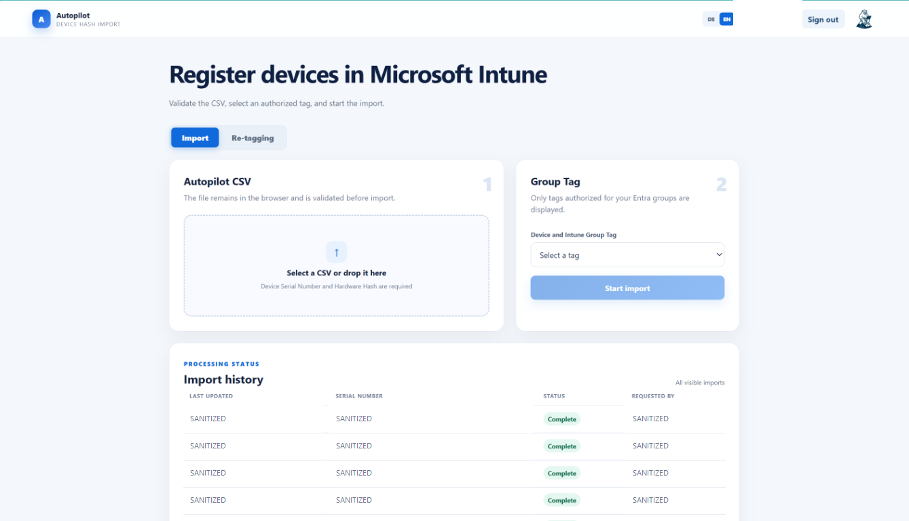
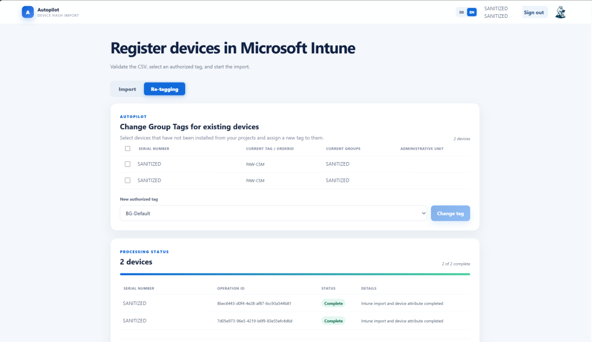

# Intune Autopilot Importer

<p align="center"></p>
<p align="center"><strong>Secure, policy-based Windows Autopilot hardware hash imports</strong></p>
<p align="center"><a href="https://github.com/Kili69/Intune-Autopilotimporter/actions/workflows/deployment-package.yml"></a> <a href="./VERSION"></a> <a href="./LICENSE"></a>  </p>

---

<p align="center"><a href="https://buymeacoffee.com/andreaslmuz"></a></p>

<br>

## In this article

<p align="center"><a href="#overview">Overview</a> &bull; <a href="#the-solution">How it works</a> &bull; <a href="#how-to-use-the-autopilot-importer">Usage</a> &bull; <a href="#re-tag-existing-autopilot-devices">Re-Tagging</a> &bull; <a href="#installation">Installation</a> &bull; <a href="#rest-api-reference">REST API</a> &bull; <a href="#troubleshooting">Troubleshooting</a></p>

## Overview

This Azure Function imports Windows Autopilot hardware hashes from a CSV file.
The user authenticates to the Function API with their Entra account. Microsoft
Graph is called exclusively through the system-assigned managed identity of the
Function.

The client requests a Device Tag. The Function accepts it only when the
server-side policy permits that tag for at least one Entra security group in
the caller's token. After Intune creates the Entra device, the Function also
writes the authorized tag to a configured Entra device extension attribute.
The default is `extensionAttribute1`. Optionally, the Function adds the device
to a configured Entra administrative unit (MAU) or restricted management
administrative unit (RMAU).

The same authorization policy also supports re-tagging existing Autopilot
devices through the web frontend, PowerShell module, or REST API. Users can
assign only Group Tags authorized for their Entra group memberships, and only
devices that have not yet contacted the Autopilot deployment service are
eligible. The asynchronous workflow updates the Autopilot Group Tag, Entra
device extension attribute, and policy-managed administrative-unit membership.

## The Problem

Granting a user permission to import Windows Autopilot hardware hashes does not, by itself, restrict which Group Tag the user can assign. The standard import authorization does not require a tag, validate that a supplied tag is approved, or verify that the importing user is authorized to use that specific tag. A user who is allowed to import a hardware hash could therefore omit the Group Tag or assign a tag intended for a different device population, potentially placing the
device into an unintended dynamic group and its associated deployment profile, applications, and policies.

Hardware hashes are also frequently imported by the device vendor before the
systems are delivered. At that time, the intended purpose, owner, or deployment
profile of each system may not yet be known, so the vendor-supplied Group Tag
can be missing or only provisional. Once the final use is determined, an
already imported device may therefore need a new Group Tag, the corresponding
Entra extension attribute, and membership in the correct administrative unit.

This project closes that authorization gap by validating the requested Group Tag server-side and allowing the import only when the authenticated user belongs to an Entra security group mapped to that tag.

## The Solution

The solution supports both importing a new device hardware hash and re-tagging
an existing Autopilot device identified by its serial number. In either
workflow, the user selects the intended Device Tag and the Function validates
the authenticated user's group membership against the configured
group-to-tag rules.

- Azure App Service Authentication, also known as Easy Auth, validates the user.
- The Function permits only Device Tags authorized for the user's Entra group membership.
- New hardware hashes are imported into Intune Autopilot; eligible existing devices can be assigned a new Group Tag through the re-tagging workflow.
- After Intune creates or updates the device, the asynchronous workflow waits for the corresponding Entra device object.
- The workflow writes the configured `extensionAttribute1` through `extensionAttribute15`, assigns the configured group membership, and adds the device to the correct administrative unit (AU).



## How to Use the Autopilot Importer

### Importing a New Device Hash

#### Use the Web Frontend

After installation, open the `webUrl` reported by the installer or stored in
`client.settings.json`. The page itself contains no tenant data and may load
without authentication. Import functions become available only after the user
signs in with a Microsoft Entra account.



The frontend provides the following functions:

- Microsoft Entra sign-in using Authorization Code Flow with PKCE
- Local validation of Autopilot CSV files before any data is transmitted
- Selection of only those Group Tags authorized for the signed-in user's Entra groups
- Parallel submission of devices
- Monitoring of both the Intune import and the Entra device extension-attribute update

The hardware hashes are not stored by the frontend. They remain in browser memory and are sent only to the secured Function API after validation and user confirmation.

##### Import Workflow and Status Updates

1. Sign in with an Entra account that belongs to an authorized importer group.
2. Select or drop an Autopilot CSV containing `Device Serial Number` and
   `Hardware Hash`.
3. Select one of the Group Tags returned for the signed-in account.
4. Start the import and keep the page open while processing continues.

The frontend performs the first status request immediately after submission.
While at least one device is pending, it refreshes the status every 15 seconds.
Polling stops when every device has reached `complete` or `error`. Temporary
status-request errors are displayed and retried during the next polling cycle.

Import IDs and status rows are kept only in the current page's memory. Closing
or reloading the page ends monitoring and clears the displayed results. The
import itself continues in Azure and can be checked later with
`Get-AutoPilotImportStatus -ImportId '<import-id>'`.

#### Import a Device During Windows OOBE

During Windows Out-of-Box Experience, press **Shift + F10** to open Command
Prompt, then start Windows PowerShell:

```cmd
powershell.exe
```

Install the standalone importer from PowerShell Gallery:

```powershell
Install-Script -Name Import-AutopilotDevice
```

On a computer where no script installation directory has been configured yet,
PowerShellGet may ask to add its Scripts directory to `PATH`. Confirm the prompt
to run the installed script by name. PowerShellGet may also ask whether the
PSGallery repository should be used; confirm only after verifying that the
repository name is `PSGallery`.

Run the importer with the complete HTTPS application URL and an authorized
Group Tag:

```powershell
Import-AutopilotDevice.ps1 `
    -ApplicationUrl 'https://<function-app-name>.azurewebsites.net' `
    -GroupTag 'Autopilot-Standard'
```

For a deployment with a custom domain, use that HTTPS origin instead:

```powershell
Import-AutopilotDevice.ps1 `
    -ApplicationUrl 'https://autopilot.contoso.com' `
    -GroupTag 'Autopilot-Standard'
```

`ApplicationUrl` must be an absolute URL including `https://`. The Function App
root, `/api/ui`, and the complete `/api/ui/index.html` URL are accepted. When
`-CsvPath` is omitted, the script reads the local BIOS serial number and
Autopilot hardware hash, signs the user in through Azure PowerShell, submits the
device, and monitors processing until the workflow completes or fails. Add
`-Verbose` to display diagnostic details.

The script requires an elevated Windows PowerShell 5.1 or PowerShell 7 session.
It installs `Az.Accounts` for the current user when the module is not already
available and has no dependency on `Get-WindowsAutopilotInfo`. Do not change the
execution policy to `Unrestricted`; use the execution policy approved by your
organization.

#### Import a Device Hash with the PowerShell Module

Use the `Import-AutoPilotDevice` command to submit one or more device hashes
from a CSV file to Intune. Before you begin, make sure that:

- `AutopilotImport.Client` has been installed.
- Your account belongs to an Entra security group that is authorized for the
  Group Tag you want to use.
- The CSV contains the columns `Device Serial Number` and `Hardware Hash`.

The installer deploys `AutopilotImport.Client`. Initialize the module once for
the current Windows user:

```powershell
Get-AutoPilotImporterClientConfiguration `
    -FunctionUrl 'https://<function-app>.azurewebsites.net'
```

The command retrieves `/api/ui/config` over HTTPS and stores the resulting
non-secret settings in
`$HOME\.autopilotimporter\client.settings.json`. Subsequent commands load that
file automatically. Use `-ConfigPath` to select another configuration file.
Explicit `-FunctionUrl`, `-ApiApplicationIdUri`, and `-TenantId` values on the
operational commands override file settings, allowing one computer to target
multiple environments.

The selected Group Tag is applied to every device in the CSV. First, validate
the file locally without signing in or sending data to the Azure Function:

```powershell
Import-AutoPilotDevice `
    -CsvPath '.\devices.csv' `
    -GroupTag 'PAW' `
    -ValidateOnly
```

If validation succeeds, run the same command without `-ValidateOnly`:

```powershell
Import-AutoPilotDevice `
    -CsvPath '.\devices.csv' `
    -GroupTag 'PAW'
```

PowerShell signs you in with your Entra account when an access token is needed.
The Azure Function then verifies that your account is authorized for the
requested Group Tag before submitting each device to Intune. No Azure role,
Microsoft Graph permission, client secret, or direct Intune role is required on
the importing computer.

#### Import a Device Hash through the REST API

Use PowerShell 7 and `Az.Accounts` to request a token for the deployed API and
submit a device directly. The account must belong to an Entra group authorized
for the requested Group Tag.

Set the deployment values and load a device from an Autopilot CSV:

```powershell
$tenantId = '<tenant-id>'
$apiAudience = 'api://<application-client-id>'
$applicationUrl = 'https://<function-app>.azurewebsites.net'
$groupTag = 'PAW'
$device = Import-Csv -LiteralPath '.\devices.csv' | Select-Object -First 1
```

Sign in, request an API token, and submit the serial number and Base64-encoded
hardware hash:

```powershell
Connect-AzAccount -Tenant $tenantId
$accessToken = Get-AzAccessToken -ResourceUrl $apiAudience
$body = @{
    serialNumber = $device.'Device Serial Number'
    hardwareIdentifier = $device.'Hardware Hash'
    groupTag = $groupTag
} | ConvertTo-Json

$response = Invoke-RestMethod `
    -Method Post `
    -Uri "$applicationUrl/api/devices/import" `
    -Authentication Bearer `
    -Token $accessToken.Token `
    -ContentType 'application/json' `
    -Body $body
$response
```

A successful request returns HTTP `202` and an `importId`. Send one request per
device when importing multiple CSV rows. See the
[REST API Reference](#rest-api-reference) for response fields, status polling,
authorization details, and error formats.

### Track Import Status

A successful request returns HTTP 202 and an `importId`. Intune processes the request asynchronously. Check the current state:

```powershell
Get-AutoPilotImportStatus -ImportId '<import-id>'
```

Wait for a final end-to-end result:

```powershell
Get-AutoPilotImportStatus `
    -ImportId '<import-id>' `
    -Wait
```

The default timeout is 30 minutes with a 15-second polling interval. Override these values with `-TimeoutSeconds` and `-PollIntervalSeconds`. Only `workflowStatus: complete` confirms that both the Intune import and the Entra extension-attribute update succeeded.

## Re-Tag Existing Autopilot Devices

The web frontend can assign a new Group Tag to existing Windows Autopilot
devices without importing their hardware hashes again. This is useful when an
uninstalled device must move to another deployment profile, device population,
or policy scope.

> [!IMPORTANT]
> Re-tagging is available only while the Autopilot device has not contacted the
> deployment service. Devices whose enrollment state is no longer
> `notContacted` are not displayed and cannot be changed through this workflow.
> The service checks eligibility again when the change is submitted and during
> asynchronous processing.



### Change Group Tags in the Web Frontend

1. Open the web frontend and sign in with your Microsoft Entra account.
2. Select the **Re-Tagging** tab.
3. Select one or more eligible devices. The table displays each serial number,
   current Group Tag or Order ID, Entra group memberships, and administrative
   units.
4. Select the new Group Tag. Only tags authorized through your Entra group
   memberships are available.
5. Select **Change tag** and keep the page open while processing continues.

Devices with an empty current Group Tag or a tag different from the authorized
target tag can be selected. Devices that already use the selected target tag
are not submitted. The frontend processes up to three selected devices in
parallel and refreshes pending operations every 15 seconds.

### Change Group Tags with the PowerShell Module

The `AutopilotImport.Client` module can list eligible devices and submit Group
Tag changes through the same secured API used by the web frontend. Initialize
the client configuration once, as described under
[Import a Device Hash with the PowerShell Module](#import-a-device-hash-with-the-powershell-module).

List devices that are still eligible for re-tagging:

```powershell
$devices = Get-AutoPilotDeviceTagAssignment
$devices |
    Select-Object id, serialNumber, groupTag, groups, administrativeUnits |
    Format-Table
```

Select a device by serial number, assign an authorized Group Tag, and wait for
the complete workflow:

```powershell
$devices |
    Where-Object serialNumber -eq 'PC-0001' |
    Set-AutoPilotDeviceGroupTag `
        -GroupTag 'Autopilot-Kiosk' `
        -Wait
```

Multiple devices can be passed through the pipeline or supplied through
`-DeviceId`. Omit `-Wait` to return as soon as the service has queued each
operation. Use `-WhatIf` to preview the selected device IDs and target Group Tag
without authenticating or submitting changes:

```powershell
Set-AutoPilotDeviceGroupTag `
    -DeviceId @(
        '11111111-1111-1111-1111-111111111111'
        '22222222-2222-2222-2222-222222222222'
    ) `
    -GroupTag 'Autopilot-Kiosk' `
    -WhatIf
```

The default wait timeout is 30 minutes with a 15-second polling interval.
Override these values with `-TimeoutSeconds` and `-PollIntervalSeconds`.

### Change Group Tags via the REST API

Use PowerShell 7 and `Az.Accounts` to acquire a token for the configured API.
Set the deployment values, sign in, and retrieve eligible devices:

```powershell
$tenantId = '<tenant-id>'
$apiAudience = 'api://<application-client-id>'
$applicationUrl = 'https://<function-app>.azurewebsites.net'

Connect-AzAccount -Tenant $tenantId
$accessToken = Get-AzAccessToken -ResourceUrl $apiAudience
$headers = @{
    Authentication = 'Bearer'
    Token = $accessToken.Token
}
$assignmentsUrl = "$applicationUrl/api/devices/tags/assignments"
$eligibleDevices = (Invoke-RestMethod `
        -Method Get `
        -Uri $assignmentsUrl `
        @headers).devices
```

Select one device and submit its new authorized Group Tag:

```powershell
$device = $eligibleDevices |
    Where-Object serialNumber -eq 'PC-0001' |
    Select-Object -First 1
$body = @{
    deviceId = $device.id
    groupTag = 'Autopilot-Kiosk'
} | ConvertTo-Json

$operation = Invoke-RestMethod `
    -Method Post `
    -Uri $assignmentsUrl `
    @headers `
    -ContentType 'application/json' `
    -Body $body
$operation
```

A successful submission returns HTTP `202` and an `operationId`. Poll the same
endpoint until `workflowStatus` is `complete`:

```powershell
do {
    Start-Sleep -Seconds 15
    $status = Invoke-RestMethod `
        -Method Get `
        -Uri "$assignmentsUrl?operationId=$($operation.operationId)" `
        @headers
    $status
} while ($status.workflowStatus -eq 'pending')
```

The service validates the target Group Tag and device eligibility for every
request. Submit one POST request per device.

### Re-Tagging Workflow

For every selected device, the Function:

1. Confirms that the target Group Tag is authorized for the signed-in user.
2. Verifies that the device still has the `notContacted` enrollment state.
3. Records the previous and requested Group Tags and queues the change.
4. Updates the Autopilot Group Tag through Microsoft Graph.
5. Writes the new tag to the configured Entra device extension attribute.
6. Synchronizes membership in the administrative unit defined by the target
   tag policy.

Each request returns an operation ID. The shared activity table shows the
current state, and the operation trace shows when the request was accepted,
queued, applied to Autopilot, written to the Entra device attribute, synchronized
with the administrative unit, and completed. Re-tagging operations also remain
available in the import history with their previous and new Group Tags.

Closing or reloading the page stops live polling but does not cancel queued
changes. Sign in again and use the history view to inspect the final result.

## Autopilot Importer Management

### Check Installed and Deployed Versions

Compare the active PowerShell module with the Function code currently serving
the management API:

```powershell
$moduleVersion = (Get-Module AutopilotImport.Client).Version
$functionVersion = (Get-AutoPilotTagPolicy -Raw).functionVersion

[pscustomobject]@{
    PowerShellModule = $moduleVersion
    AzureFunction    = $functionVersion
}
```

Import `AutopilotImport.Client` first if `Get-Module` returns no result. The
Function version is also returned in the `X-AutopilotImport-Version` response
header. Updating the Function deployment and updating client modules are
separate operations, so their versions can temporarily differ.

### Read Import History

Every authenticated importer can read the imports they requested during the
last 30 days. The command is exported by the `AutopilotImport.Client` module.
It is not a standalone script in the extracted deployment package. Install the
generated client module package as described under
[Distribute the Import Client to Additional PCs](#5-distribute-the-import-client-to-additional-pcs),
then open a new PowerShell 7 session.

Verify which installed module version provides the command:

```powershell
Get-Command Get-AutoPilotImportHistory -All |
    Select-Object Name, Version, Source
```

If an older module is already loaded in the current session, load the newest
installed version:

```powershell
$module = Get-Module -ListAvailable AutopilotImport.Client |
    Sort-Object Version -Descending |
    Select-Object -First 1

if (-not $module) {
    throw 'AutopilotImport.Client is not installed. Extract the generated client module package into a directory listed in $env:PSModulePath.'
}

Remove-Module AutopilotImport.Client -ErrorAction SilentlyContinue
Import-Module $module.Path -Force
```

Then retrieve the import history:

```powershell
Get-AutoPilotImportHistory
```

Retrieve one or more specific records by their displayed import ID, Autopilot
serial number, or the Base64 DeviceHash used for the import. These targeted
lookups also show who requested the import, even when it was requested by
another user. A serial number can be supplied as the first positional value:

```powershell
Get-AutoPilotImportHistory -ImportId @(
    '11111111-1111-1111-1111-111111111111'
    '22222222-2222-2222-2222-222222222222'
)

Get-AutoPilotImportHistory '7892-5288-2670-2860-4823-9507-73'

$deviceHash = (Import-Csv '.\AutopilotHWID.csv')[0].'Hardware Hash'
Get-AutoPilotImportHistory -DeviceHash $deviceHash
```

Configured importer managers and, when enabled, Intune Role Administrators can
request every retained record or filter retained imports by requesting user:

```powershell
Get-AutoPilotImportHistory -ShowAll
Get-AutoPilotImportHistory -User 'aa@bloedgelaber.de'
```

The command displays a compact table with import GUID (`ImportId`), serial
number, Group Tag, status, requesting user, request time, completion time, and
Intune error name. Every row remains a PowerShell object that can be filtered,
exported, or inspected with all available properties:

```powershell
Get-AutoPilotImportHistory | Format-List *
```

The command returns up to 100 operations by default. Request up to 1000 and
filter the objects in the pipeline, for example to inspect failed imports:

```powershell
Get-AutoPilotImportHistory -Top 1000 |
    Where-Object Status -eq 'error'
```

Each result contains the import ID, batch import ID, serial number, Group Tag,
status, Intune error details, and the requesting user's display name, user
principal name, and Entra object ID. UTC timestamps record when the request was
received, the Graph import was created, processing was queued and started, the
Entra device was resolved, its extension attribute was updated, optional
administrative-unit membership was confirmed, and processing completed.
Audit metadata is stored for 30 days in the deployment's private Azure Table
Storage. The raw DeviceHash and its SHA-256 search index are stored with the
audit record; product keys are not stored. Neither value is returned in history
results, and the client sends only the SHA-256 index when `-DeviceHash` is used.
A timer removes expired records hourly. Imports created before this audit
feature was deployed cannot be found by DeviceHash because no hash was recorded
for them.

If the command reports that the history endpoint was not found, update the
Function App with `Update-AutopilotImport.ps1` without `-SkipPublish`. A 404
response means the deployed Function package does not contain the
`GetImportHistory` endpoint; it does not mean that the history is empty.

### Change Group-to-Tag Assignments

The installing user, configured manager users or groups, and current members of the Intune RBAC role `Intune Role Administrator` may update the policy. They do not need Azure resource permissions.

Read the current policy:

```powershell
Get-AutoPilotTagPolicy
```

#### Add a Group Tag Policy

`Add-AutoPilotTagPolicy` adds an Entra group to the policy without replacing
the other group rules. If the group already has a rule, the command adds the
specified tags to that rule. Existing and duplicate tags are retained only
once.

Parameters:

- `-GroupId` accepts the Entra group object ID. `-Group` remains available as
    an alias for compatibility.
- `-GroupTag` accepts one or more Autopilot Group Tags. `-Tag` is an alias.
- `-Mau` optionally sets a regular or restricted management administrative
    unit for the added or updated rule. The full parameter name is
    `-AdministrativeUnitName`. If omitted, an existing unit for that rule is
    preserved; a new rule has no administrative unit. Supply an empty string
    to remove the assignment.
- `-WhatIf` previews the update without writing it to the Azure Function.

Add a group by its object ID and set the MAU:

```powershell
Add-AutoPilotTagPolicy `
    -GroupId '11111111-1111-1111-1111-111111111111' `
    -GroupTag 'Autopilot-Privileged' `
    -Mau 'MAU-Autopilot-Devices' `
    -WhatIf
```

Run the command without `-WhatIf` to apply the change.

Add another tag to an existing group rule without changing its other tags:

```powershell
Add-AutoPilotTagPolicy `
    -GroupId '11111111-1111-1111-1111-111111111111' `
    -GroupTag 'Autopilot-Shared'
```

#### Remove a Group Tag Policy

`Remove-AutoPilotTagPolicy` removes selected tags from one Entra group when
`-GroupTag` is supplied. Without `-GroupTag`, it removes the complete Group Tag
rule for that group. Other group rules and their individual RMAUs remain
unchanged. The command does not delete the group from Entra.

Parameters:

- `-Group` accepts either the Entra group object ID or its exact display name.
    `-GroupId` and `-GroupName` are aliases for this parameter.
- `-GroupTag` optionally selects one or more tags to remove. `-Tag` is an alias.
    Omit it to remove the complete group rule.
- `-WhatIf` previews the removal without writing it to the Azure Function.

Remove one tag while preserving the group's other tags:

```powershell
Remove-AutoPilotTagPolicy `
    -Group '11111111-1111-1111-1111-111111111111' `
    -GroupTag 'Autopilot-Kiosk'
```

Remove a rule using its exact Entra group display name:

```powershell
Remove-AutoPilotTagPolicy `
    -Group 'Obsolete Autopilot Group' `
    -WhatIf
```

Alternatively, remove it by group object ID:

```powershell
Remove-AutoPilotTagPolicy `
    -Group '11111111-1111-1111-1111-111111111111'
```

If multiple Entra groups have the same display name, use the object ID. The
last tag cannot be removed from a group rule. Omit `-GroupTag` to remove that
complete rule instead. The last policy rule cannot be removed because the
Function requires at least one group-to-tag rule. Run the command without
`-WhatIf` to apply the removal.

After a successful complete-rule removal, the command prints a concise message
such as `The tag policy for group 'Obsolete Autopilot Group' was removed.`
Removing selected tags produces the corresponding tag-specific message. The
returned string also exposes `GroupId`, `GroupName`, `RemovedTags`,
`RuleRemoved`, `CorrelationId`, `Updated`, and `ApiResponse` properties for
automation.

#### Replace the Complete Group Tag Policy

Each rule can specify its own regular or restricted management administrative
unit through `administrativeUnitName`.
Preview the complete desired policy before applying it:

```powershell
Set-AutoPilotTagPolicy `
    -TagAuthorizationRule @(
        [pscustomobject]@{
            groupId = '11111111-1111-1111-1111-111111111111'
            tags = @('Autopilot-Standard', 'Autopilot-Kiosk')
            administrativeUnitName = 'RMAU-Standard'
        }
        [pscustomobject]@{
            groupId = '33333333-3333-3333-3333-333333333333'
            tags = @('Autopilot-Privileged')
            administrativeUnitName = 'RMAU-Privileged'
        }
    ) `
    -WhatIf
```

Run the same command without `-WhatIf` to apply it. Omit a previous rule to
remove that group. Omit `administrativeUnitName` from a
rule to disable automatic administrative-unit membership for that rule.
`-AdministrativeUnitName` or `-Mau` applies a shared fallback to string rules.

Every configured administrative unit must already exist and have a unique
display name. This is validated through Microsoft Graph before a new or
updated policy is saved. Both units with and without
`isMemberManagementRestricted` enabled are supported. Without a configured
unit on the matching rule, imports continue without automatic membership.

### Change Group Tag Managers

List the installing manager and all additionally configured managers:

```powershell
Get-AutoPilotTagPolicyManager
```

The command returns structured objects containing `FunctionAppName`,
`PrincipalId`, and `ManagerType` (`Installer` or `Additional`). It reads the
manager policy through Azure and does not modify it.

`Add-AutoPilotTagPolicyManager`, `Remove-AutoPilotTagPolicyManager`, and
`Update-AutoPilotTagPolicyManager` can be run only by a principal with an
effective Azure `Owner` or `Contributor` assignment on the Function App, its
resource group, or its subscription. Being an explicitly configured Group Tag
manager or an Intune Role Administrator does not grant permission to change the
manager list.

```powershell
Update-AutoPilotTagPolicyManager `
    -AddPrincipalId '44444444-4444-4444-4444-444444444444' `
    -RemovePrincipalId '33333333-3333-3333-3333-333333333333' `
    -WhatIf
```

The convenience commands enforce the same Azure role check:

```powershell
Add-AutoPilotTagPolicyManager `
    -PrincipalId '44444444-4444-4444-4444-444444444444'

Remove-AutoPilotTagPolicyManager `
    -PrincipalId '33333333-3333-3333-3333-333333333333'
```

The installing user cannot be removed. Authorization for current Intune Role Administrators remains enabled.

## Installation

### Prerequisites

- An Azure subscription and an active Intune tenant
- For the simplest end-to-end installation, the installing administrator needs the Azure `Owner` role at subscription scope and the Entra ID `Global Administrator` role. For a least-privilege installation, see [Required Roles and Permissions](#required-roles-and-permissions).
- For a least-privilege Azure installation, the installing administrator needs at least `Reader` at subscription scope and, on the target resource group, `Contributor` plus `Role Based Access Control Administrator` or `User Access Administrator`; alternatively, `Owner` on the target resource group. Resource-group write permissions without subscription-level read access are not sufficient.
- For a least-privilege Entra installation, the installing administrator needs the `Application Administrator`, `Privileged Role Administrator`, and `Global Reader` directory roles.
- PowerShell 7.2 or later on the importing computer
- An Autopilot CSV containing `Device Serial Number` and `Hardware Hash`
- For deployment: `Az.Accounts`, `Az.Resources`, `Az.Storage`, `Az.Websites`, and the Bicep CLI; `-InstallMissingModules` installs missing components. See [Appendix: Bicep CLI in Restricted Environments](#appendix-bicep-cli-in-restricted-environments) when automatic downloads are blocked.
- For the one-time permission assignment: `Microsoft.Graph.Authentication`

### Quick Installation Guide

1. Obtain the Azure, Entra ID, and delegated Microsoft Graph permissions listed under [Required Roles and Permissions](#required-roles-and-permissions). The installing administrator needs all applicable permissions for the complete setup.
2. Download `Intune-autopilotImporter-<branch><version>.zip` and extract it. Open PowerShell 7 in the extracted package directory containing `Install-AutopilotImport.ps1`.
3. Start the interactive installation. Missing PowerShell modules and the Bicep CLI are installed when required:

```powershell
pwsh .\Install-AutopilotImport.ps1 -InstallMissingModules
```

1. After installation, extract the generated client module package from the current user's Documents directory into the PowerShell 7 module directory:

```powershell
$documents = [Environment]::GetFolderPath('MyDocuments')
$moduleRoot = Join-Path $documents 'PowerShell\Modules'

New-Item -Path $moduleRoot -ItemType Directory -Force | Out-Null
Expand-Archive `
    -LiteralPath (Join-Path $documents `
        'Intune-Autopilotimport-psmodule-<version>.zip') `
    -DestinationPath $moduleRoot `
    -Force
```

The archive already contains the required versioned module layout and the generated `client.settings.json`.

For a repeatable parameterized deployment, supply the deployment values
directly:

```powershell
pwsh .\Install-AutopilotImport.ps1 `
    -SubscriptionId '00000000-0000-0000-0000-000000000000' `
    -TenantId '11111111-1111-1111-1111-111111111111' `
    -ResourceGroupName 'rg-autopilot-import' `
    -Location 'westus2' `
    -FunctionAppName 'func-autopilot-contoso' `
    -TagAuthorizationRule `
        '22222222-2222-2222-2222-222222222222=Standard,Kiosk' `
    -InstallMissingModules `
    -Confirm:$false
```

Use `Get-Help .\Install-AutopilotImport.ps1 -Full` for all parameters and
examples. Entra application internals, manual alternatives, Graph permission
assignment, Azure deployment, Function publishing, pipeline, update, package,
and Bicep details are documented in the
[Developer Guide](DEVELOPER.md#deployment-and-installation-internals).

##### Distribute the Import Client to Additional PCs

The Azure Function itself remains in Azure. An importing PC needs only:

- Windows PowerShell 5.1 or PowerShell 7.2 or later
- `scripts\Import-AutopilotDevice.ps1`
- HTTPS access to Microsoft Entra sign-in and the Function App
- HTTPS access to the PowerShell Gallery when `Az.Accounts` is not installed

The `src\AutopilotImport` module, Function folders, Bicep template, deployment scripts, and `Microsoft.Graph.Authentication` are not required on importing PCs. `Microsoft.Graph.Authentication` is used only for administrative setup.

When authentication is first needed, the script checks for the required
`Az.Accounts` commands. If they are missing, it installs the NuGet package
provider when necessary and downloads `Az.Accounts` from the PowerShell Gallery
for the current user. `-ValidateOnly` and `-WhatIf` do not install modules.

To prepare a PC in advance, install `Az.Accounts` for the current user:

```powershell
Install-Module Az.Accounts `
        -Scope CurrentUser `
        -Repository PSGallery `
        -Force
```

For a managed installation available to all users, run the following command as an administrator or deploy it through the organization's software management system:

```powershell
Install-Module Az.Accounts `
        -Scope AllUsers `
        -Repository PSGallery `
        -Force
```

In networks without direct PowerShell Gallery access, download the module and its dependencies on a connected staging PC:

```powershell
$packagePath = 'C:\AutopilotImportPackage'
New-Item -ItemType Directory -Path "$packagePath\Modules" -Force | Out-Null

Save-Module Az.Accounts `
        -Path "$packagePath\Modules" `
        -Repository PSGallery `
        -Force

Copy-Item .\scripts\Import-AutopilotDevice.ps1 `
        -Destination $packagePath
```

Copy the package to each target PC and place every directory below `Modules` in a PowerShell 7 module path. For a per-machine installation, use:

```powershell
$packagePath = 'C:\AutopilotImportPackage'
$modulePath = "$env:ProgramFiles\PowerShell\Modules"

Get-ChildItem "$packagePath\Modules" -Directory | ForEach-Object {
        Copy-Item $_.FullName -Destination $modulePath -Recurse -Force
}
```

This copy step requires local administrator rights. For a per-user installation, use `$HOME\Documents\PowerShell\Modules` instead. Distribute the same package with Microsoft Intune, Configuration Manager, Group Policy, or
another software deployment system when many PCs must be maintained. Sign the PowerShell script with a trusted code-signing certificate when the target environment enforces `AllSigned` or `RemoteSigned`; do not weaken the execution
policy as part of deployment.

Start the standalone script with the HTTPS application URL. The Function App
root, `/api/ui`, and `/api/ui/index.html` forms are accepted. The script reads
tenant, audience, and import endpoint data from `/api/ui/config` and rejects an
import endpoint hosted on another origin:

```powershell
powershell.exe -NoProfile -File .\Import-AutopilotDevice.ps1 `
    -ApplicationUrl 'https://<function-app>.azurewebsites.net' `
    -CsvPath '.\devices.csv' `
    -GroupTag 'PAW' `
    -Verbose
```

When `-CsvPath` is omitted, run PowerShell elevated so the script can read the
local BIOS serial number and `MDM_DevDetail_Ext01` hardware hash. CSV files must
contain `Device Serial Number` and `Hardware Hash`. The selected Group Tag is
applied to every row.

The standalone import script supports Windows PowerShell 5.1 and later and
installs `Az.Accounts` on demand. The `AutopilotImport.Client` module retains
its PowerShell 7.2 requirement. Managing the
explicit manager list additionally requires `Az.Resources` and `Az.Websites`.
The project module dependency is included in the installed package.

## Advanced Setup

### Required Roles and Permissions

Azure RBAC roles, Entra directory roles, Microsoft Graph permissions, and the application role of this Function serve different purposes. They do not grant one another implicitly.
For a standard installation, one installing administrator performs the complete setup and therefore needs the applicable Azure roles, Entra directory role, and delegated Microsoft Graph permissions listed below. The scopes remain technically independent even though they are assigned to the same administrator.

| Identity | Scope | Required role or permission | Purpose |
| --- | --- | --- | --- |
| Installing administrator | Azure subscription | `Contributor` plus `Role Based Access Control Administrator` or `User Access Administrator`; alternatively `Owner` | Creates the resource group and resources, then assigns the scoped Storage data roles required for keyless access. |
| Installing administrator | Existing Azure resource group and Azure subscription | At least `Reader` at subscription scope, plus `Contributor` and `Role Based Access Control Administrator` or `User Access Administrator` on the resource group; alternatively `Owner` on the resource group | Deploys and manages resources in the existing resource group while retaining the subscription-level read access required by the installer. Resource-group write permissions alone are not sufficient. |
| Installing administrator | Deployed Storage Account | `Storage Blob Data Contributor` | Uploads the initial Group Tag authorization policy using the signed-in Entra identity. Assigned automatically by the installer. |
| Installing administrator | Entra ID | Application owner, `Application Administrator`, or `Cloud Application Administrator` | Required when the app registration or enterprise application must be created or changed. An already compliant application is reused without a write. |
| Installing administrator | Entra ID | `Global Reader` | Reads tenant and directory configuration required during installation. |
| Installing administrator | Microsoft Graph, delegated | `Application.ReadWrite.All`, `User.Read` | Configures the API application and records the installing user as a permanent Group Tag manager. |
| Installing administrator | Entra ID | `Privileged Role Administrator` or `Global Administrator` | Assigns the Microsoft Graph application permission to the Function App managed identity. |
| Installing administrator | Microsoft Graph, delegated | `Application.Read.All`, `AppRoleAssignment.ReadWrite.All` | Resolves the Microsoft Graph service principal and creates the app-role assignment for the managed identity. Admin consent is required. |
| Function App managed identity | Microsoft Graph, application | `DeviceManagementServiceConfig.ReadWrite.All` | Imports Windows Autopilot device identities. |
| Function App managed identity | Microsoft Graph, application | `DeviceManagementRBAC.Read.All` | Checks current membership of the Intune RBAC role `Intune Role Administrator` for Group Tag management requests. |
| Function App managed identity | Microsoft Graph, application | `GroupMember.Read.All`, `User.ReadBasic.All` | Checks the importing user's current membership in the Entra groups configured by the Group Tag policy. |
| Function App managed identity | Microsoft Graph, application | `Device.ReadWrite.All` | Writes the authorized Group Tag to the configured Entra device extension attribute after the device is created. |
| Function App managed identity | Microsoft Graph, application | `AdministrativeUnit.ReadWrite.All` | Resolves the optional MAU and adds the imported Entra device as a member. |
| Function App managed identity | Deployed Storage Account | `Storage Blob Data Owner` | Provides keyless host storage access and reads or updates the Group Tag authorization policy. Assigned automatically by the installer. |
| Function App managed identity | Deployed Storage Account | `Storage Queue Data Contributor` | Queues and retries the Entra device extension attribute update while Autopilot processing is incomplete. Assigned automatically by the installer. |
| Importing user or group | Function API | Matching group-to-tag rule | Allows importing devices with only the tags assigned to the caller's Entra security group. |

The web frontend also lists Windows Autopilot devices whose enrollment state is
`notContacted` when the signed-in user has at least one authorized Group Tag.
The current Group Tag may be empty or belong to another rule; authorization is
enforced on the selected target Group Tag. Users can select multiple devices
and assign an authorized Group Tag. The same queued post-processing used after imports updates
the configured Entra extension attribute, removes memberships from other
administrative units managed by the Tag policy, and adds the target rule's
administrative unit. Current Entra group and administrative-unit memberships
are shown for each eligible device.
| Group Tag manager | Function API | Installer, configured manager user/group, or `Intune Role Administrator` | Reads and replaces the group-to-tag policy without Azure resource permissions. |
| Manager-list administrator | Azure Function App | `Owner` or `Contributor` at Function or ancestor scope | Adds or removes explicitly configured manager users and groups. The management script rejects other roles. |

The standard installer creates three role assignments scoped to the deployed Storage Account. The installing user receives `Storage Blob Data Contributor`, and the Function managed identity receives `Storage Blob Data Owner` and
`Storage Queue Data Contributor`. The installer therefore needs both resource deployment permissions and
`Microsoft.Authorization/roleAssignments/write`. If organizational policy uses custom Azure roles, they must also allow Function ZIP publishing for the resource types defined in `src/Infrastructure/main.bicep`.

The Consumption-plan deployment requires the Storage Account data endpoint to permit public network access. Blob public access and shared-key authentication remain disabled; both the installer and Function authenticate with Entra ID.
If Azure Policy requires `PublicNetworkAccess=Disabled`, this architecture requires a VNet-integrated hosting plan, Storage Private Endpoints, and private DNS instead of the standard Consumption template.

Importing users require no Azure subscription role, Entra directory role, Microsoft Graph permission, or direct Intune administrative role. Authorization is provided by the configured group-to-tag rule. The Function's managed
identity holds the Intune-related Graph permissions independently of the user.

Do not grant other principals Azure roles that can modify the Function App's application settings or deployed code. Such permissions can change the manager policy outside the provided script and therefore bypass its strict
`Owner`/`Contributor` check.

### Advanced Installer Parameters

Use the installer parameters when the deployment must be repeatable, run
without prompts, or target an existing configuration:

```powershell
pwsh .\Install-AutopilotImport.ps1 `
    -SubscriptionId '<Subscription-ID>' `
    -TenantId '<Tenant-ID>' `
    -ResourceGroupName 'rg-autopilot-import' `
    -Location 'westeurope' `
    -FunctionAppName '<globally-unique-name>' `
    -DeviceTagExtensionAttribute 'extensionAttribute1' `
    -TagAuthorizationRule `
        '11111111-1111-1111-1111-111111111111=Autopilot-Standard,Autopilot-Kiosk' `
    -AdministrativeUnitName 'MAU-Autopilot-Devices' `
    -TagManagerPrincipalId `
        '22222222-2222-2222-2222-222222222222' `
    -ClientToolsPath 'C:\Tools\AutopilotImport' `
    -InstallMissingModules `
    -Confirm:$false
```

The most commonly used options are:

- `-SubscriptionId`, `-TenantId`, `-ResourceGroupName`, `-Location`, and
  `-FunctionAppName` select the Azure deployment target.
- `-TagAuthorizationRule` defines one or more Entra group-to-Group Tag rules.
- `-AdministrativeUnitName` assigns the default administrative unit used by
  the configured Group Tag policy.
- `-DeviceTagExtensionAttribute` selects the Entra device extension attribute
  that stores the authorized Group Tag.
- `-TagManagerPrincipalId` adds an initial user or group that can manage the
  Group Tag policy.
- `-EntraClientId` selects an existing API application instead of searching by
  its display name.
- `-ClientToolsPath` selects the destination for the generated client tools.
- `-InstallMissingModules` installs supported missing PowerShell modules and
  the Bicep CLI.
- `-ForceGraphSignIn` starts a fresh Microsoft Graph device-code sign-in.
- `-WhatIf` previews the resolved configuration without changing Azure or
  Entra resources. Use `-Confirm:$false` for approved non-interactive runs.

Run `Get-Help .\Install-AutopilotImport.ps1 -Full` for the complete parameter
reference. The [Developer Guide](DEVELOPER.md#deployment-and-installation-internals)
contains the detailed application, deployment, update, and package procedures.

### Pipeline Installation

The repository includes `azure-pipelines.yml` for repeatable Azure DevOps
deployments. Pull requests run the Pester tests. A successful run on `main`
deploys the Bicep infrastructure and Function ZIP, then publishes the generated
`client.settings.json` as the `autopilot-import-client-settings` pipeline
artifact.

Before the first run:

1. Create an Azure Resource Manager service connection using workload identity
   federation. Grant its service principal `Contributor` on the target resource
   group, or at subscription scope when the pipeline must create the resource
   group.
2. Create the variable group `autopilot-import-deployment` and authorize the
   pipeline to use it.
3. Configure the deployment values for the Azure subscription, tenant,
   resource group, region, Function App name, API and SPA client IDs, the
   permanent manager principal, and the complete Group Tag policy.
4. Configure the Entra API and SPA applications once from an administrator
   workstation and provide their client IDs to the variable group.
5. After the first deployment creates the Function managed identity, assign
   its Microsoft Graph application permissions with
   `Grant-ManagedIdentityGraphPermission.ps1`.

The pipeline service principal does not need Microsoft Graph permissions.
Privileged Entra application setup and managed-identity permission assignment
remain separate administrator steps. Configure approvals and checks on the
Azure DevOps environment when production deployments require manual approval.
See the [Developer Guide](DEVELOPER.md#deployment-and-installation-internals)
for the variable names, application bootstrap commands, and permission
assignment example.

## REST API Reference

The Azure Function exposes REST endpoints for importing and re-tagging devices,
reading authorized Group Tags, inspecting import history, and managing the
Group Tag policy. Replace `<function-app>` in the paths below with the deployed
Function App hostname:

```text
https://<function-app>.azurewebsites.net
```

### Authentication and Authorization

Protected endpoints require an OAuth 2.0 bearer token for the configured
`API_AUDIENCE` and its `DeviceHash.Import` scope:

```http
Authorization: Bearer <access-token>
```

Azure App Service Authentication validates the token before forwarding the
request. The Function uses the resulting Easy Auth principal to authorize the
operation. Clients must not create or trust an `x-ms-client-principal` header
themselves.

Device endpoints authorize callers through their Entra group claims and the
Group Tag policy. Management endpoints additionally require the caller to be
the installing principal, a configured manager user or group, or, when
enabled, a current Intune Role Administrator.

Successful and error responses include an `X-Correlation-Id` header and a
matching `correlationId` JSON property. Use this value when correlating client
errors with Application Insights logs.

| Method | Route | Authorization | Purpose |
| --- | --- | --- | --- |
| `GET` | `/api/devices/tags` | Authorized importer | List Group Tags available to the caller |
| `POST` | `/api/devices/import` | Authorized importer | Submit an Autopilot device identity |
| `GET` | `/api/devices/import?importId=<guid>` | Authorized importer | Read import and post-processing status |
| `GET` | `/api/devices/tags/assignments` | Authorized importer | List devices eligible for a Group Tag change |
| `POST` | `/api/devices/tags/assignments` | Authorized importer | Queue a Group Tag change |
| `GET` | `/api/devices/tags/assignments?operationId=<guid>` | Requesting importer | Read Group Tag change status |
| `GET` | `/api/management/imports?top=<count>` | Group Tag manager | Read recent import operations |
| `GET` | `/api/management/tag-policy` | Group Tag manager | Read the complete Group Tag policy |
| `PUT` | `/api/management/tag-policy` | Group Tag manager | Replace the complete Group Tag policy |

### Get Authorized Group Tags

```http
GET /api/devices/tags
```

The response contains only tags assigned to at least one Entra group in the
caller's token:

```json
{
    "tags": ["Autopilot-Standard", "Autopilot-Kiosk"],
    "correlationId": "00000000-0000-0000-0000-000000000000"
}
```

### Submit an Autopilot Device

```http
POST /api/devices/import
Content-Type: application/json
```

```json
{
    "serialNumber": "PC-0001",
    "hardwareIdentifier": "<base64-encoded-hardware-hash>",
    "groupTag": "Autopilot-Standard"
}
```

`serialNumber`, `hardwareIdentifier`, and `groupTag` are required. The server
validates the requested tag against the caller's groups and resolves the RMAU
from the matching policy rule. A successful submission returns HTTP `202`:

```json
{
    "importId": "00000000-0000-0000-0000-000000000000",
    "serialNumber": "PC-0001",
    "groupTag": "Autopilot-Standard",
    "status": "notReceived",
    "correlationId": "00000000-0000-0000-0000-000000000000"
}
```

### Get Import Status

```http
GET /api/devices/import?importId=<import-id>
```

The caller must still be authorized for the Group Tag attached to the import.
The response combines the Intune import state with the asynchronous Entra
device attribute and RMAU processing state:

```json
{
    "importId": "00000000-0000-0000-0000-000000000000",
    "serialNumber": "PC-0001",
    "groupTag": "Autopilot-Standard",
    "status": "complete",
    "workflowStatus": "complete",
    "deviceErrorCode": 0,
    "deviceErrorName": null,
    "extensionAttributeName": "extensionAttribute1",
    "extensionAttributeStatus": "complete",
    "extensionAttributeValue": "Autopilot-Standard",
    "entraDeviceId": "00000000-0000-0000-0000-000000000000",
    "correlationId": "00000000-0000-0000-0000-000000000000"
}
```

Only `workflowStatus: complete` confirms completion of both the Intune import
and the configured Entra post-processing.

### Get Import History

```http
GET /api/management/imports?top=100
```

Without additional filters, the endpoint returns only imports requested by the
authenticated caller. `showAll=true` and user-principal-name filters require
importer-manager authorization. Targeted lookups use `POST` with up to 50
combined import IDs, serial numbers, user principal names, and SHA-256
DeviceHash indexes:

```http
POST /api/management/imports?top=100
Content-Type: application/json

{
    "importIds": ["00000000-0000-0000-0000-000000000000"],
    "serialNumbers": ["7892-5288-2670-2860-4823-9507-73"],
    "users": ["aa@bloedgelaber.de"],
    "deviceHashSha256": ["9f64a747e1b97f131fabb6b447296c9b6f0201e79fb3c5356e6c77e89b6a806a"]
}
```

`top` is optional, defaults to `100`, and must be between `1` and `1000`. Only
records from the last 30 days are returned. The response intentionally excludes
raw DeviceHashes, their indexes, and product keys:

```json
{
    "imports": [
        {
            "importId": "00000000-0000-0000-0000-000000000000",
            "batchImportId": "00000000-0000-0000-0000-000000000000",
            "serialNumber": "PC-0001",
            "groupTag": "Autopilot-Standard",
            "status": "complete",
            "deviceErrorCode": 0,
            "deviceErrorName": null,
            "requestedBy": "ada@example.com",
            "requestedByObjectId": "11111111-1111-1111-1111-111111111111",
            "requestedByUserPrincipalName": "ada@example.com",
            "requestedByDisplayName": "Ada Lovelace",
            "requestReceivedAtUtc": "2026-09-18T10:00:00.0000000Z",
            "graphImportCreatedAtUtc": "2026-09-18T10:00:01.0000000Z",
            "queuedAtUtc": "2026-09-18T10:00:02.0000000Z",
            "processingStartedAtUtc": "2026-09-18T10:01:00.0000000Z",
            "entraDeviceResolvedAtUtc": "2026-09-18T10:02:00.0000000Z",
            "extensionAttributeUpdatedAtUtc": "2026-09-18T10:02:01.0000000Z",
            "administrativeUnitAssignedAtUtc": "2026-09-18T10:02:02.0000000Z",
            "processingCompletedAtUtc": "2026-09-18T10:02:03.0000000Z"
        }
    ],
    "count": 1,
    "correlationId": "00000000-0000-0000-0000-000000000000"
}
```

### Read the Group Tag Policy

```http
GET /api/management/tag-policy
```

The response uses the normalized policy format. Every rule can have its own
optional MAU or RMAU through `administrativeUnitName`:

```json
{
    "policy": [
        {
            "groupId": "11111111-1111-1111-1111-111111111111",
            "tags": ["Autopilot-Standard", "Autopilot-Kiosk"],
            "administrativeUnitName": "RMAU-Standard"
        },
        {
            "groupId": "22222222-2222-2222-2222-222222222222",
            "tags": ["Autopilot-Privileged"],
            "administrativeUnitName": "RMAU-Privileged"
        }
    ],
    "correlationId": "00000000-0000-0000-0000-000000000000"
}
```

### Replace the Group Tag Policy

```http
PUT /api/management/tag-policy
Content-Type: application/json
```

The operation replaces the complete policy. Omitted rules are removed. Use the
structured `policy` format to configure an individual RMAU for each rule:

```json
{
    "policy": [
        {
            "groupId": "11111111-1111-1111-1111-111111111111",
            "tags": ["Autopilot-Standard", "Autopilot-Kiosk"],
            "administrativeUnitName": "RMAU-Standard"
        },
        {
            "groupId": "22222222-2222-2222-2222-222222222222",
            "tags": ["Autopilot-Privileged"],
            "administrativeUnitName": "RMAU-Privileged"
        }
    ]
}
```

Omit `administrativeUnitName` from a rule when imports
matching that rule must not add the device to an RMAU. Each `groupId` must be a
GUID, each rule must contain at least one tag, tags must not exceed 128
characters or contain commas, and an RMAU name must not exceed 256 characters.

The `rules` request format accepts string rules. Its single administrative
unit is applied to every supplied rule:

```json
{
    "rules": [
        "11111111-1111-1111-1111-111111111111=Autopilot-Standard,Autopilot-Kiosk"
    ],
    "administrativeUnitName": "RMAU-Standard"
}
```

Both formats return HTTP `200` with the normalized `policy` array and a
`correlationId`.

### Public UI Endpoints

`GET /` redirects to `/api/ui/index.html`. `GET /api/ui/config` returns the
public MSAL and API configuration required by the browser client, while
`GET /api/ui/{*path}` serves the static frontend. These routes do not expose
policy or import data and are the only routes that do not require an access
token.

### Error Responses

Errors use a stable JSON envelope:

```json
{
    "error": "invalidRequest",
    "message": "Human-readable details when safe to return",
    "correlationId": "00000000-0000-0000-0000-000000000000"
}
```

Common status codes are:

- `400 Bad Request`: malformed input, invalid IDs, or an invalid policy
- `401 Unauthorized`: authentication is missing or invalid
- `403 Forbidden`: the caller is not authorized for the tag or management API
- `404 Not Found`: a requested static frontend resource does not exist
- `500 Internal Server Error`: required service configuration is missing or invalid
- `502 Bad Gateway`: a Microsoft Graph operation failed
- `503 Service Unavailable`: manager authorization could not be verified

## Troubleshooting

### PowerShell Module or Client Configuration Does Not Work

Run all commands in PowerShell 7 (`pwsh`), not Windows PowerShell 5.1. Confirm
the active version first:

```powershell
$PSVersionTable.PSVersion
```

The major version must be `7`, and the version must be `7.2` or later. Check
whether PowerShell can find the client module and which version it selects:

```powershell
$module = Get-Module -ListAvailable AutopilotImport.Client |
    Sort-Object Version -Descending |
    Select-Object -First 1

$module | Format-List Name, Version, ModuleBase, Path
```

If no module is returned, extract the portable client package into a
PowerShell 7 module directory. For a per-user installation, the resulting
layout must be:

```text
Documents\PowerShell\Modules\AutopilotImport.Client\<version>\AutopilotImport.Client.psd1
Documents\PowerShell\Modules\AutopilotImport.Client\<version>\AutopilotImport.Client.psm1
Documents\PowerShell\Modules\AutopilotImport.Client\<version>\AutopilotImport.psm1
Documents\PowerShell\Modules\AutopilotImport.Client\<version>\client.settings.json
```

Inspect the active module paths if the module is installed elsewhere:

```powershell
$env:PSModulePath -split [IO.Path]::PathSeparator
```

When the module exists but commands are missing or an older version is loaded,
remove the loaded copy and import the newest manifest explicitly:

```powershell
Remove-Module AutopilotImport.Client -Force -ErrorAction SilentlyContinue
Import-Module $module.Path -Force -Verbose
Get-Command -Module AutopilotImport.Client
```

Install the required authentication dependency when `Get-AzContext`,
`Connect-AzAccount`, or `Get-AzAccessToken` is unavailable:

```powershell
Install-Module Az.Accounts `
    -Scope CurrentUser `
    -Repository PSGallery `
    -Force
```

The default configuration must be named `client.settings.json` and must be in
the same directory as `AutopilotImport.Client.psm1`. Check the file selected by
the newest module version:

```powershell
$settingsPath = Join-Path $module.ModuleBase 'client.settings.json'
Test-Path $settingsPath
Get-Content $settingsPath -Raw | ConvertFrom-Json |
    Format-List functionUrl, managementUrl, apiApplicationIdUri, tenantId,
        subscriptionId, resourceGroupName, functionAppName
```

If the file is missing, invalid JSON, or points to the wrong Function App,
recreate it from the deployed Azure resources. The signed-in account must be
able to read the Function App's Easy Auth configuration:

```powershell
$createdSettings = New-AutoPilotImporterClientConfiguration `
    -SubscriptionId '<Subscription-ID>' `
    -ResourceGroupName '<Resource-Group-Name>' `
    -TenantId '<Tenant-ID>' `
    -FunctionAppName '<Function-App-Name>' `
    -OutputPath $PWD `
    -Force

Copy-Item `
    -LiteralPath $createdSettings.FullName `
    -Destination $module.ModuleBase `
    -Force
```

After replacing the configuration, reload the module so subsequent commands
use the new file:

```powershell
Remove-Module AutopilotImport.Client -Force -ErrorAction SilentlyContinue
Import-Module $module.Path -Force
```

To test a configuration before copying it into the module directory, pass it
explicitly to a read-only command:

```powershell
Get-AutoPilotTagPolicy -ConfigPath $createdSettings.FullName
```

If multiple module versions are installed, each version has its own
`client.settings.json`. Update the directory reported by `$module.ModuleBase`,
or remove obsolete versions to prevent PowerShell from loading an unexpected
configuration. Do not place `client.settings.json.example` in the module
directory without replacing all placeholder values and renaming it to
`client.settings.json`.

## Appendix: Use a Company DNS Name

The web frontend can be published under a company-owned DNS name such as
`autopilot.contoso.com` instead of exposing the generated Function App hostname
to users. The resulting frontend URL is:

```text
https://autopilot.contoso.com/api/ui/index.html
```

This requires four coordinated configurations. A DNS record alone is not
sufficient:

- A public company DNS subdomain
- A custom-domain assignment on the Azure Function App
- A valid TLS certificate and hostname binding
- A matching redirect URI on the `Autopilot Import Web` Entra application

Keep the native `https://<function-app-name>.azurewebsites.net` hostname active
during and after the migration. It remains useful for diagnostics and is
required when `Update-AutopilotImport.ps1 -FunctionUrl` discovers the Azure
deployment.

### 1. Create the Company DNS Records

In the Azure portal, open the deployed Function App and select
**Settings > Custom domains > Add custom domain**. Enter the complete company
hostname, for example `autopilot.contoso.com`. Azure displays the values needed
to validate ownership. Create the following public records in the company's DNS
zone:

| Type | Name | Value |
| --- | --- | --- |
| CNAME | `autopilot` | `<function-app-name>.azurewebsites.net` |
| TXT | `asuid.autopilot` | Custom Domain Verification ID shown by Azure |

The record names above assume the DNS zone is `contoso.com`. Some DNS providers
expect only the relative names `autopilot` and `asuid.autopilot`; others expect
the complete names. Do not include `https://` or a URL path in a DNS record.
Keep the TXT record after validation because it proves ownership and helps
protect the hostname from subdomain takeover.

Wait for DNS propagation, then use **Validate** in the Azure portal and add the
custom domain to the Function App. A successful DNS lookup does not by itself
complete the Azure hostname assignment.

### 2. Enable HTTPS for the Company Hostname

Configure an **SNI SSL** binding for the custom hostname. Use an App Service
Managed Certificate when it is available for the selected Function hosting
plan, or bind a valid certificate uploaded directly or sourced from Azure Key
Vault. The certificate must include `autopilot.contoso.com` in its subject or
Subject Alternative Name and must contain the complete certificate chain.

Do not distribute the company URL until Azure reports the custom domain as
**Secured** and a browser opens it without a certificate warning. Establish a
renewal process when the certificate is not managed automatically by Azure.

### 3. Add the Entra Redirect URI

In **Microsoft Entra ID > App registrations**, open the separate
`Autopilot Import Web` application. Under **Authentication > Single-page
application**, add this exact redirect URI:

```text
https://autopilot.contoso.com/api/ui/index.html
https://autopilot.contoso.com/api/ui/auth.html
```

Redirect URIs are case-sensitive and must match the complete URL returned by
`https://autopilot.contoso.com/api/ui/config`. Keep the existing
`index.html` and `auth.html` redirect URIs for the native
`azurewebsites.net` hostname until the company hostname has been tested and all
bookmarks have been migrated. The dedicated `auth.html` page allows MSAL to
complete silent token acquisition without weakening the frame protection of
the application UI. The API Application ID URI and audience, such as
`api://<application-client-id>`, do not change.

After the custom domain is assigned to the Function App, subsequent runs of
`Update-AutopilotImport.ps1` discover it and ensure that its frontend redirect
URIs remain registered in the Entra SPA application.

### 4. Validate the Company URL

Test the configuration in this order:

1. Confirm that `https://autopilot.contoso.com/api/ui/config` returns the
   frontend configuration and that its endpoint URLs use the company hostname.
2. Open `https://autopilot.contoso.com/api/ui/index.html` in a private browser
   window and confirm that it loads without a TLS warning.
3. Sign in with an authorized test account and submit a test CSV.
4. Confirm that the import status reaches `complete`.

The OOBE helper can then open the company URL directly:

```powershell
.\scripts\Start-IntuneAutopilotImporter.ps1 `
    -WebUrl 'https://autopilot.contoso.com/api/ui/index.html'
```

The endpoint values in `client.settings.json` may continue to use the native
`azurewebsites.net` hostname. Change them to the company hostname only when the
PowerShell client must also call the APIs through that hostname. For deployment
discovery and updates, continue to use the native hostname:

```powershell
.\Update-AutopilotImport.ps1 `
    -FunctionUrl 'https://<function-app-name>.azurewebsites.net' `
    -WhatIf
```

For current platform details, see the Microsoft guidance for
[mapping an existing custom domain](https://learn.microsoft.com/azure/app-service/app-service-web-tutorial-custom-domain),
[binding a TLS certificate](https://learn.microsoft.com/azure/app-service/configure-ssl-bindings),
and [configuring SPA redirect URIs](https://learn.microsoft.com/entra/identity-platform/reply-url).

## Appendix: Developer Information

See [DEVELOPER.md](DEVELOPER.md) for the complete repository layout, local build
and frontend build process, deployment and installation internals, PowerShell
Gallery publishing, installation package mapping, CI sequence, branch promotion
policy, tests, versioning, operations, and build troubleshooting.

## Appendix: Bicep CLI in Restricted Environments

When `-InstallMissingModules` is specified, the installer uses `winget install Microsoft.Bicep` when `winget` is available. On Windows Server and other systems without `winget`, it downloads the official standalone Bicep executable for the current architecture into the current user's local application directory. If application control, proxy settings, or network restrictions prevent either automatic method, install the standalone Bicep CLI before starting the deployment. Azure PowerShell requires a separately installed `bicep` command; the copy managed internally by Azure CLI is not available to Azure PowerShell.

Use the official [Bicep installation documentation](https://learn.microsoft.com/azure/azure-resource-manager/bicep/install) and download one of these Windows assets from the [latest Bicep release](https://github.com/Azure/bicep/releases/latest):

- `bicep-setup-win-x64.exe`: run the installer. It installs Bicep for the current user and adds it to the user `PATH` without requiring local administrator rights.
- `bicep-win-x64.exe`: use this standalone binary when installers are blocked. Download it on an approved connected computer, transfer it to the deployment computer, rename it to `bicep.exe`, and place it in a directory permitted by application control and included in `PATH`.

Close and reopen PowerShell after changing the persistent `PATH`, then verify the installation:

```powershell
Get-Command bicep
bicep --version
```

## License

Copyright 2026 Andreas Lucas.

Licensed under the [Apache License, Version 2.0](./LICENSE). The software is
provided on an "AS IS" basis, without warranties or conditions of any kind.
Microsoft product names are used only to identify the services with which this
project interoperates; this project is not an official Microsoft product.
